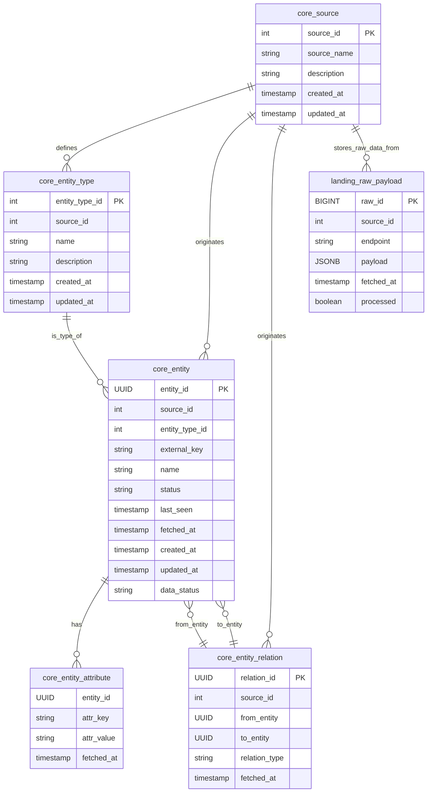

# Meta - ERD

```mermaid
erDiagram
    core_source {
        int source_id PK
        string source_name
        string description
        timestamp created_at
        timestamp updated_at
    }

    core_entity_type {
        int entity_type_id PK
        int source_id
        string name
        string description
        timestamp created_at
        timestamp updated_at
    }

    core_entity {
        UUID entity_id PK
        int source_id
        int entity_type_id
        string external_key
        string name
        string status
        timestamp last_seen
        timestamp fetched_at
        timestamp created_at
        timestamp updated_at
        string data_status
    }

    core_entity_attribute {
        UUID entity_id
        string attr_key
        string attr_value
        timestamp fetched_at
    }

    core_entity_relation {
        UUID relation_id PK
        int source_id
        UUID from_entity
        UUID to_entity
        string relation_type
        timestamp fetched_at
    }

    landing_raw_payload {
        BIGINT raw_id PK
        int source_id
        string endpoint
        JSONB payload
        timestamp fetched_at
        boolean processed
    }

    %% Relationships
    core_source ||--o{ core_entity_type : defines
    core_source ||--o{ core_entity : originates
    core_source ||--o{ core_entity_relation : originates
    core_source ||--o{ landing_raw_payload : stores_raw_data_from

    core_entity_type ||--o{ core_entity : is_type_of

    core_entity ||--o{ core_entity_attribute : has

    core_entity }o--|| core_entity_relation : from_entity
    core_entity }o--|| core_entity_relation : to_entity
```

