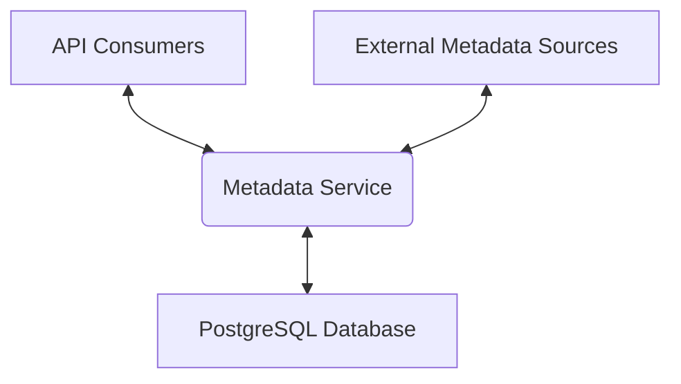
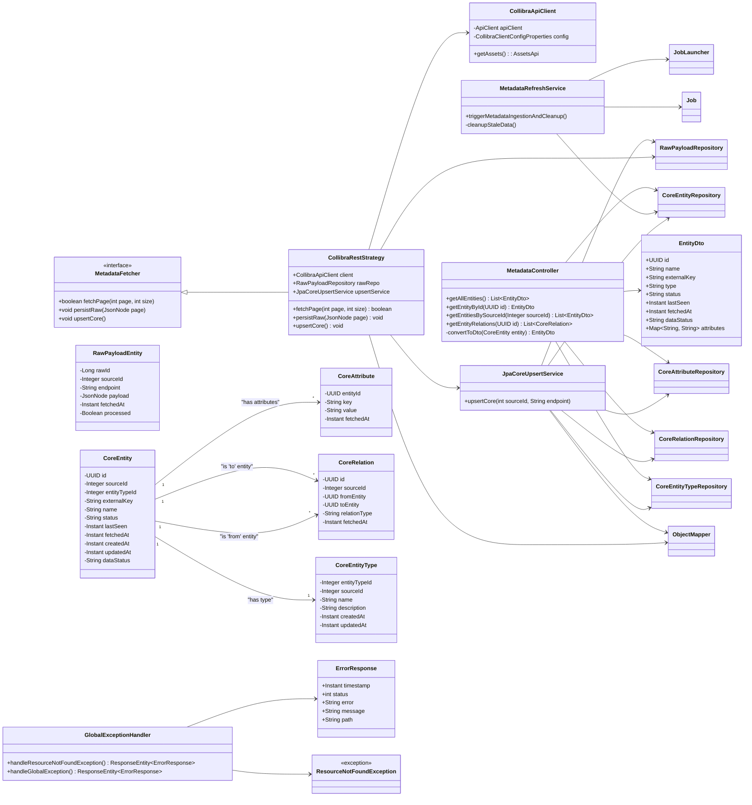
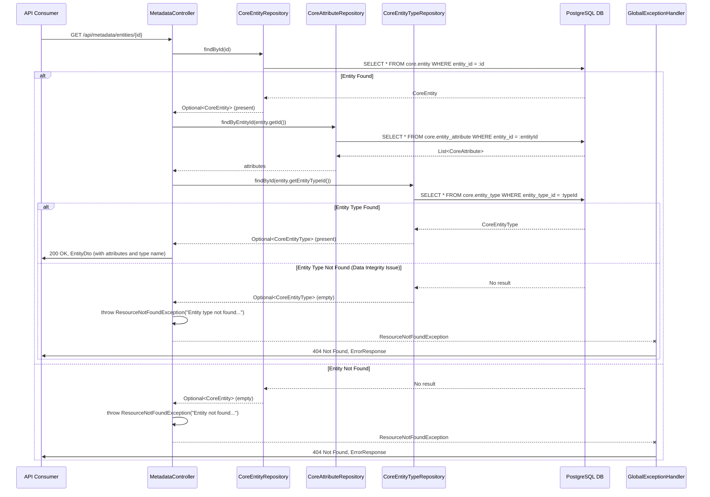

Metadata Service: Comprehensive Documentation
This document provides a step-by-step guide on how to set up, configure, and run the Metadata Service application. It also includes a detailed technical write-up covering High-Level Design (HLD) and Low-Level Design (LLD), explaining architectural decisions and component interactions, along with an Entity-Relationship Diagram (ERD).

1. How to Use This Code (Step-by-Step Guide)
Follow these steps to get the Metadata Service up and running.

1.1. Prerequisites
Before you begin, ensure you have the following installed:

Java Development Kit (JDK) 17 or higher:
Verify with: java --version
Gradle (Optional, but recommended): The project uses a Gradle wrapper (./gradlew), so direct Gradle installation isn't strictly necessary, but it helps for common commands.
Verify with: gradle --version
PostgreSQL Database: The application uses PostgreSQL as its primary data store.
Ensure you have a PostgreSQL server running and accessible.
You'll need credentials for a user with sufficient permissions to create schemas and tables.
Git (Optional): If cloning the repository.
1.2. Project Setup
Obtain the Code:
If the code is in a Git repository:
git clone <repository-url>
cd <project-directory>
If you have the files locally, ensure they are organized as a standard Spring Boot Gradle project (e.g., src/main/java, src/main/resources, build.gradle, etc.).
Database Creation:
Connect to your PostgreSQL server (e.g., using psql, pgAdmin, or DBeaver).
Create a new database for the application. For example:
CREATE DATABASE metadata_cache;
Make a note of the database name, username, and password, as you'll need them for configuration.
1.3. Configuration
The application's configuration is managed through src/main/resources/application.yaml. You need to externalize sensitive variables or environment-specific values.

Open src/main/resources/application.yaml:
Database Configuration: Update the spring.datasource section with your PostgreSQL details. It's configured to read from environment variables for production readiness, but you can hardcode values for local development if preferred.
spring:
  datasource:
    url: ${DB_URL:jdbc:postgresql://localhost:5432/metadata_cache}
    username: ${DB_USERNAME:postgres}
    password: ${DB_PASSWORD:password}
Local Dev Example (hardcoded):
spring:
  datasource:
    url: jdbc:postgresql://localhost:5432/metadata_cache
    username: postgres
    password: my_db_password
Production Example (via environment variables):
export DB_URL="jdbc:postgresql://your-prod-db:5432/metadata_cache_prod"
export DB_USERNAME="prod_user"
export DB_PASSWORD="prod_password"
./gradlew bootRun
Collibra API Client Configuration: Update the collibra section.
collibra:
  base-url: ${COLLIBRA_BASE_URL:http://localhost:8081} # Replace with your Collibra tenant URL
  username: ${COLLIBRA_USERNAME:your-collibra-user}    # Replace with your Collibra username
  password: ${COLLIBRA_PASSWORD:your-collibra-password} # Replace with your Collibra password
  source-id: ${COLLIBRA_SOURCE_ID:1}                   # Unique ID for Collibra in your 'core.source' table
Note: The source-id must match the source_id value for 'Collibra' in your core.source table (which is seeded with 1 by default via Liquibase).
Cache Retention: Adjust the metadata.cache.retention.days as needed.
metadata:
  cache:
    retention.days: ${METADATA_CACHE_RETENTION_DAYS:7} # Data considered fresh for X days
Retry Configuration: The retry.collibra section configures the retry logic for Collibra API calls.
retry:
  collibra:
    max-attempts: 3
    backoff-delay-ms: 1000
    backoff-multiplier: 2
Hibernate DDL (IMPORTANT): Ensure spring.jpa.hibernate.ddl-auto is set to none for production environments.
spring:
  jpa:
    hibernate:
      ddl-auto: none # IMPORTANT: Set to 'none' for production. Use 'update' ONLY for development.
1.4. Database Migration (Liquibase)
The project uses Liquibase for database schema management.

Open a terminal in the project's root directory.
Run the Liquibase update command:
./gradlew liquibaseUpdate
This command will apply the schema changes defined in src/main/resources/db/changelog/db.changelog-master.xml to your configured PostgreSQL database. It will create the core and landing schemas and their respective tables, along with seeding initial core.source and core.entity_type data.
1.5. Build and Run the Application
Build the Project:
./gradlew build
This compiles the Java code, runs tests, and packages the application into a JAR file.
Run the Application:
./gradlew bootRun
The application will start, typically on http://localhost:8080. You will see Spring Boot logs in your console.
1.6. Accessing the Application
OpenAPI Documentation (Swagger UI):
Once the application is running, open your web browser and navigate to:
http://localhost:8080/swagger-ui.html
This provides an interactive API documentation interface where you can explore and test the REST endpoints.
Test REST Endpoints:
Get all entities: GET http://localhost:8080/api/metadata/entities
Get entity by ID: GET http://localhost:8080/api/metadata/entities/{uuid} (You'll need a UUID from your database after a successful batch run).
Get entities by Source ID: GET http://localhost:8080/api/metadata/entities/by-source/{sourceId} (e.g., 1 for Collibra)
1.7. Running Tests
To run the JUnit test cases provided in the test files:

./gradlew test
This command will execute all unit and integration tests defined in src/test/java.

2. Configuration Steps
This section details the key configuration properties found in src/main/resources/application.yaml.

Property Key	Description	Default Value	Externalization (Env Variable)
server.port	The HTTP port on which the Spring Boot application will listen.	8080	-
spring.datasource.url	JDBC URL for the PostgreSQL database.	jdbc:postgresql://localhost:5432/metadata_cache	DB_URL
spring.datasource.username	Username for connecting to the PostgreSQL database.	postgres	DB_USERNAME
spring.datasource.password	Password for connecting to the PostgreSQL database.	password	DB_PASSWORD
spring.jpa.hibernate.ddl-auto	Hibernate DDL generation strategy. For production, this MUST be none. update is only for development convenience.	none	-
spring.batch.jdbc.initialize-schema	Controls how Spring Batch's internal schema (for job repository) is initialized. always is suitable for development.	always	-
spring.batch.job.enabled	Disables automatic execution of Spring Batch jobs on application startup. Jobs are manually triggered by MetadataRefreshService.	false	-
collibra.base-url	Base URL of your Collibra Data Governance Center (DGC) instance.	http://localhost:8081	COLLIBRA_BASE_URL
collibra.username	Username for authenticating with the Collibra API.	your-collibra-user	COLLIBRA_USERNAME
collibra.password	Password for authenticating with the Collibra API.	your-collibra-password	COLLIBRA_PASSWORD
collibra.source-id	An integer ID that uniquely identifies Collibra as a data source within your core.source table. This must match the source_id column in core.source for Collibra.	1	COLLIBRA_SOURCE_ID
metadata.cache.retention.days	The number of days after which fetched metadata is considered 'STALE'. Used by MetadataRefreshService for cleanup.	7	METADATA_CACHE_RETENTION_DAYS
retry.collibra.max-attempts	Maximum number of retry attempts for Collibra API calls.	3	-
retry.collibra.backoff-delay-ms	Initial backoff delay (in milliseconds) before the first retry attempt for Collibra API calls.	1000	-
retry.collibra.backoff-multiplier	Multiplier for exponential backoff between retry attempts for Collibra API calls (e.g., 2.0 means 1s, 2s, 4s delays).	2.0	-
springdoc.swagger-ui.path	Path to access the Swagger UI (OpenAPI documentation).	/swagger-ui.html	-
springdoc.api-docs.path	Path to access the raw OpenAPI JSON specification.	/api-docs	-
3. Technical Write-up: High-Level and Low-Level Design
3.1. High-Level Design (HLD)
The Metadata Service is designed as a standalone Spring Boot application responsible for ingesting, curating, caching, and serving metadata from various external sources. Its primary goal is to provide a unified, performant, and reliable access layer to metadata, abstracting away the complexities and specific APIs of different source systems.

Architectural Principles:

Abstraction: Decouple metadata ingestion logic from specific source systems.
Modularity: Clearly defined components with single responsibilities.
Resilience: Handle transient errors during external API calls.
Scalability: Use Spring Batch for robust, restartable data ingestion.
Maintainability: JPA for persistence, OpenAPI for API documentation.
Data Freshness: Explicit caching strategy with defined retention.
3.1.1. Key Components
REST API Layer (MetadataController): Exposes curated metadata entities via REST endpoints for consumption by other applications or users. Uses OpenAPI 3 for documentation.
Metadata Fetching Layer (MetadataFetcher & Implementations):
MetadataFetcher (Interface): Defines the contract for fetching data from any metadata source.
CollibraRestStrategy (Implementation): Concrete strategy for interacting with the Collibra API.
Data Ingestion & Curation (Spring Batch, JpaCoreUpsertService):
Spring Batch: Orchestrates the multi-step data ingestion process (fetch raw, upsert to core). Provides robustness, monitoring, and restartability.
JpaCoreUpsertService: Handles the transformation and persistence of raw data into the normalized core database schema. This service now includes logic to dynamically create missing entity types and upsert relations uniquely (updating existing ones rather than creating duplicates).
Scheduling & Refresh (MetadataRefreshService): Triggers the Spring Batch ingestion job periodically and manages data freshness by marking old data as stale.
Data Storage (PostgreSQL):
landing schema: Stores raw, unprocessed JSON payloads from external sources. Acts as a staging area.
core schema: Stores normalized, curated metadata entities, attributes, and relationships. This is the application's "cache" or "single source of truth" for served metadata.
External API Client (CollibraApiClient): A client library (mocked in the provided code) responsible for direct communication with the external metadata source's API. Test-specific static state for failure simulation has been removed from this production class.
3.1.2. High-Level Data Flow
The data flow can be visualized as follows:
```mermaid
graph TD
    subgraph External Metadata Sources
        A[Collibra DGC] -->|API Calls| B(CollibraRestStrategy)
    end

    subgraph Metadata Service (Spring Boot Application)

        subgraph "Data Ingestion: fetchStep (Tasklet)"
            direction LR
            J[MetadataRefreshService] -->|Triggers Daily| K(Spring Batch Job Launcher)
            K -->|Runs Job| L(metadataJob)
            L -->|Starts| M(fetchStep)
            M --> B
            B -- fetches pages --> D[persistRaw]
            D -- persists raw JSON --> E[PostgreSQL: landing.raw_payload]
        end

        subgraph "Data Curation: mergeStep (Multi-threaded, Chunk-based)"
            direction LR
            L -->|After fetchStep| N(mergeStep)
            N -- reads in chunks --> O(RawPayloadReader)
            O -- reads from --> E
            O -- sends chunk of raw data --> P(MetadataProcessor)
            P -- transforms & enriches --> Q(CoreMetadataWriter)
            Q -- writes batch to DB --> R[PostgreSQL: core schema]
        end

        subgraph "API Layer"
            S[API Consumers] <-->|Secure API Calls| T(MetadataController)
            T -- queries curated data --> R
        end
    end

```
3.1.3. High-Level Component Interaction (DFD Level 0)

3.2. Low-Level Design (LLD)
3.2.1. Core Concepts & Decision Choices
MetadataFetcher (Strategy Pattern):
Decision: Use a MetadataFetcher interface (fetchPage, persistRaw, upsertCore). This implements the Strategy Pattern, allowing easy integration of new metadata sources (e.g., Apache Atlas, Tableau) without modifying the core ingestion logic.
Benefit: High extensibility. Adding a new source simply requires creating a new MetadataFetcher implementation and its corresponding API client.
Two-Phase Data Persistence (Landing & Core Schemas):
Decision: Store raw JSON payloads in landing.raw_payload first, then transform and store curated data in core.entity, core.entity_attribute, core.entity_relation.
Benefit:
Auditability: Preserves the original raw data received from the source.
Resilience: If transformation fails, you can re-process the raw data.
Decoupling: Raw schema changes don't immediately impact the core schema.
landing.raw_payload acts as a short-term, raw data cache before curation.
Spring Batch for Ingestion:
Decision: Leverage Spring Batch for the data ingestion pipeline (fetchStep, mergeStep).
Benefit:
Robustness: Provides transactional processing, restartability (important for large datasets), and skip/retry logic.
Monitoring: Spring Batch's JobRepository tracks job executions, steps, and status, providing observability.
Scalability: Designed for high-volume, enterprise-grade batch processing.
JPA for Core Data Persistence (JpaCoreUpsertService):
Decision: Use Spring Data JPA with Hibernate for managing core.* entities.
Benefit:
Productivity: Reduces boilerplate code for CRUD operations.
Object-Relational Mapping (ORM): Maps Java objects to database tables, simplifying data manipulation.
Transactions: Spring's @Transactional annotation simplifies transaction management.
Enhanced Data Integrity: Now includes logic to create missing entity types on the fly and properly upsert relations (updating existing ones) to maintain data consistency.
Data Freshness / Caching (fetched_at, data_status, @Scheduled):
Decision: Instead of a traditional in-memory cache, the database itself acts as the persistent cache. Data freshness is managed by fetched_at timestamp on core.entity and a data_status field. A scheduled job periodically marks old data as "STALE".
Benefit:
Durability: Data persists across application restarts.
Consistency: All consumers see the same "cached" data.
Simple Freshness Policy: Easy to implement time-based cache invalidation (marking as stale).
Explicit Status: Allows distinguishing between "fresh" and "stale" data for consumers.
Spring Retry for External API Calls:
Decision: Use Spring Retry's @Retryable annotation on the fetchPage method in CollibraRestStrategy.
Benefit:
Resilience: Automatically retries transient network or API errors, making the ingestion more robust.
Configurable: Retry attempts and backoff strategies are externalized in application.yaml.
OpenAPI 3 (Springdoc) for REST Documentation:
Decision: Integrate springdoc-openapi-starter-webmvc-ui.
Benefit:
API Discoverability: Automatically generates interactive API documentation (Swagger UI).
Usability: Provides clear descriptions of endpoints, request/response structures, and error handling.
Developer Experience: Simplifies integration for consumers of the metadata service.
Centralized Error Handling (@ControllerAdvice):
Decision: Use @ControllerAdvice and @ExceptionHandler for global error handling in the REST layer.
Benefit:
Consistency: All API errors return a standardized ErrorResponse DTO.
Maintainability: Error handling logic is centralized, reducing duplication in controllers.
Improved UX: Provides clear, descriptive error messages to API consumers.
3.2.2. Component Diagrams
3.2.2.1. Class Diagram (Simplified)

3.2.2.2. Sequence Diagram: Metadata Ingestion Job
This sequence diagram illustrates the flow of a single run of the Spring Batch ingestion job, triggered by the scheduler.
```mermaid
sequenceDiagram
    participant S as MetadataRefreshService (Scheduler)
    participant JL as Spring Batch JobLauncher
    participant J as metadataJob (Spring Batch)
    participant FS as fetchStep (Tasklet)
    participant CRS as CollibraRestStrategy
    participant CAC as CollibraApiClient
    participant RR as RawPayloadRepository
    participant MS as mergeStep (Tasklet)
    participant JUS as JpaCoreUpsertService
    participant ER as CoreEntityRepository
    participant AR as CoreAttributeRepository
    participant RELR as CoreRelationRepository
    participant ETR as CoreEntityTypeRepository
    participant DB as PostgreSQL DB

    S->>JL: triggerMetadataIngestionAndCleanup()
    JL->>J: run(metadataJob)
    J->>FS: start()
    loop Fetch Pages
        FS->>CRS: fetchPage(page, size)
        CRS->>CAC: getAssets().getAssets(page, size)
        alt API Call Success
            CAC->>CRS: AssetPage (JSON)
            CRS->>RR: save(RawPayloadEntity)
            RR->>DB: INSERT into landing.raw_payload
            DB-->>RR: OK
            CRS-->>FS: hasMorePages = true/false
        else API Call Failure (Retryable)
            CAC--xCRS: Exception (e.g., Network)
            CRS--xCRS: Retry attempts (configured by @Retryable)
            alt All Retries Fail
                CRS--xFS: MetadataFetchException
                FS--xJ: StepExecutionException (Job Fails)
                J--xJL: JobExecution (FAILED)
                JL--xS: Exception
                S->>S: Log Error
                break Loop ends
            end
        end
    end
    FS->>J: finished()
    J->>MS: start()
    MS->>JUS: upsertCore(sourceId, endpoint)
    JUS->>RR: findBySourceIdAndEndpointAndProcessedFalse()
    RR->>DB: SELECT from landing.raw_payload (where processed=false)
    DB-->>RR: List<RawPayloadEntity>
    RR-->>JUS: rawPayloads
    loop For each rawPayload
        JUS->>ER: findBySourceIdAndExternalKey()
        ER->>DB: SELECT from core.entity
        DB-->>ER: Optional<CoreEntity> (found/not found)
        ER-->>JUS: entityStatus
        JUS->>ETR: findBySourceIdAndName()
        ETR->>DB: SELECT from core.entity_type
        DB-->>ETR: Optional<CoreEntityType>
        ETR-->>JUS: entityType
        alt Entity Type Found
            ETR-->>JUS: existing CoreEntityType
        else Entity Type Not Found
            JUS->>ETR: save(new CoreEntityType)
            ETR->>DB: INSERT into core.entity_type
            DB-->>ETR: new CoreEntityType (with ID)
            ETR-->>JUS: newly created CoreEntityType
        end
        JUS->>ER: save(CoreEntity)
        ER->>DB: INSERT/UPDATE core.entity
        DB-->>ER: OK
        JUS->>AR: save(CoreAttribute)
        AR->>DB: INSERT/UPDATE core.entity_attribute
        DB-->>AR: OK
        JUS->>RELR: findBySourceIdAndFromEntityAndToEntityAndRelationType()
        RELR->>DB: SELECT from core.entity_relation
        DB-->>RELR: Optional<CoreRelation>
        alt Relation Exists
            RELR-->>JUS: existing CoreRelation
            JUS->>RELR: save(existing CoreRelation with updated fetched_at)
            RELR->>DB: UPDATE core.entity_relation
        else Relation Does Not Exist
            RELR-->>JUS: Optional<CoreRelation> (empty)
            JUS->>RELR: save(new CoreRelation)
            RELR->>DB: INSERT core.entity_relation
        end
        DB-->>RELR: OK
        JUS->>RR: save(rawPayload.setProcessed(true))
        RR->>DB: UPDATE landing.raw_payload
        DB-->>RR: OK
    end
    JUS-->>MS: OK
    MS->>J: finished()
    J->>JL: JobExecution (COMPLETED)
    JL->>S: OK
    S->>S: cleanupStaleData()
    S->>ER: markEntitiesAsStale(cutoffTime)
    ER->>DB: UPDATE core.entity SET data_status = 'STALE'
    DB-->>ER: Rows Updated
    ER-->>S: Count
    S->>S: Log Success
```
3.2.2.3. Sequence Diagram: Get Entity by ID (REST API)
This sequence diagram illustrates how a client retrieves a single curated entity via the REST API.

3.2.2.4. Entity-Relationship Diagram (ERD)
This ERD illustrates the database schema for the Metadata Service, showing entities, their attributes, primary keys (PK), foreign keys (FK), and relationships.
```mermaid
erDiagram
    core_source {
        SERIAL source_id PK
        TEXT source_name UK
        TEXT description
        TIMESTAMPTZ created_at
        TIMESTAMPTZ updated_at
    }

    core_entity_type {
        SERIAL entity_type_id PK
        INT source_id FK
        TEXT name UK
        TEXT description
        TIMESTAMPTZ created_at
        TIMESTAMPTZ updated_at
    }

    core_entity {
        UUID entity_id PK
        INT source_id FK
        INT entity_type_id FK "Index Added"
        TEXT external_key UK
        TEXT name
        TEXT status
        TIMESTAMPTZ last_seen
        TIMESTAMPTZ fetched_at "Index Exists"
        TIMESTAMPTZ created_at
        TIMESTAMPTZ updated_at
        TEXT data_status "Index Exists"
    }

    core_entity_attribute {
        UUID entity_id PK FK
        TEXT attr_key PK
        TEXT attr_value
        TIMESTAMPTZ fetched_at
    }

    core_entity_relation {
        UUID relation_id PK
        INT source_id FK
        UUID from_entity FK "Index Added"
        UUID to_entity FK "Index Added"
        TEXT relation_type
        TIMESTAMPTZ fetched_at
    }

    landing_raw_payload {
        BIGSERIAL raw_id PK
        INT source_id FK
        TEXT endpoint
        JSONB payload
        TIMESTAMPTZ fetched_at
        BOOLEAN processed "Index Added"
    }

    core_source ||--o{ core_entity_type : "defines"
    core_source ||--o{ core_entity : "originates"
    core_source ||--o{ core_entity_relation : "originates"
    core_entity_type ||--o{ core_entity : "is_type_of"
    core_entity ||--o{ core_entity_attribute : "has"
    core_entity }o--|| core_entity_relation : "from_entity_is"
    core_entity }o--|| core_entity_relation : "to_entity_is"
    core_source ||--o{ landing_raw_payload : "stores_raw_data_from"
```
4. Complete Code Listing
Below is the complete and updated code for the Metadata Service application, incorporating all the discussed fixes and best practices.

```groovy
// build.gradle
plugins {
    id 'java'
    id 'org.springframework.boot' version '3.1.4'
    id 'io.spring.dependency-management' version '1.1.0'

    // Liquibase Gradle plugin for database migrations
    id 'org.liquibase.gradle' version '2.1.1'
}

group = 'com.example'
version = '0.1.0'
sourceCompatibility = '17' // Ensure Java 17 compatibility

repositories {
    mavenCentral() // Standard Maven central repository
    mavenLocal() // For your locally published Collibra client (if applicable)
}

dependencies {
    // Spring Boot starters for core functionalities
    implementation 'org.springframework.boot:spring-boot-starter-webflux' // For WebClient (reactive web)
    implementation 'org.springframework.boot:spring-boot-starter-batch' // For Spring Batch processing
    implementation 'org.springframework.boot:spring-boot-starter-data-jpa' // For JPA and Hibernate integration
    implementation 'org.springframework.boot:spring-boot-starter-jdbc' // For JDBC (Spring's JdbcTemplate)
    implementation 'org.springframework.boot:spring-boot-starter-validation' // For request body validation
    implementation 'org.springframework.boot:spring-boot-starter-security' // For future authentication/authorization

    // Jackson for JSON processing
    implementation 'com.fasterxml.jackson.core:jackson-databind'

    // Collibra API client (assuming it's published to your local Maven repository)
    // Replace with the actual group, artifact, and version of your generated client
    implementation 'com.example:import-api-java-client:0.0.1'

    // PostgreSQL database driver
    runtimeOnly 'org.postgresql:postgresql'

    // Hibernate Types for handling JSONB columns in PostgreSQL
    implementation 'com.vladmihalcea:hibernate-types-52:2.20.1'

    // Liquibase Core for database schema migrations
    implementation 'org.liquibase:liquibase-core:4.18.0'

    // Lombok for boilerplate code reduction (getters, setters, constructors, etc.)
    compileOnly 'org.projectlombok:lombok'
    annotationProcessor 'org.projectlombok:lombok'

    // Spring Boot Configuration Processor for custom @ConfigurationProperties
    annotationProcessor 'org.springframework.boot:spring-boot-configuration-processor'

    // OpenAPI 3 (Swagger UI) for API documentation
    implementation 'org.springdoc:springdoc-openapi-starter-webmvc-ui:2.2.0'

    // Spring Retry for resilient external API calls
    implementation 'org.springframework.retry:spring-retry'
    implementation 'org.springframework:spring-aspects' // Required for @Retryable to work

    // Testing dependencies
    testImplementation 'org.springframework.boot:spring-boot-starter-test' // Standard Spring Boot testing
    testImplementation 'org.springframework.batch:spring-batch-test' // Spring Batch specific testing utilities
    dependencies {
    implementation 'org.springframework.boot:spring-boot-starter-web'
    implementation 'org.springframework.boot:spring-boot-starter-batch'
    implementation 'org.springframework.boot:spring-boot-starter-data-jpa'
    implementation 'org.springframework.boot:spring-boot-starter-oauth2-resource-server'
    implementation 'org.springframework.boot:spring-boot-starter-oauth2-jose'
    implementation 'org.springframework.retry:spring-retry'
    implementation 'org.springframework:spring-aspects'
    implementation 'org.springdoc:springdoc-openapi-starter-webmvc-ui:2.2.0'
    implementation 'com.fasterxml.jackson.core:jackson-databind'
    implementation 'org.liquibase:liquibase-core:4.18.0'
    runtimeOnly   'org.postgresql:postgresql'
    compileOnly   'org.projectlombok:lombok'
    annotationProcessor 'org.projectlombok:lombok'
    testImplementation 'org.springframework.boot:spring-boot-starter-test'
    testImplementation 'org.springframework.batch:spring-batch-test'
}
}

// Spring Boot specific configuration
springBoot {
    mainClass = 'com.example.metadata.Application' // Specifies the main application class
}

// Java compilation options
tasks.withType(JavaCompile) {
    options.encoding = 'UTF-8' // Set character encoding
    options.release = 17 // Target Java 17 bytecode
}

// Liquibase Gradle plugin configuration
liquibase {
    activities {
        main {
            // Path to your master changelog file
            changeLogFile 'src/main/resources/db/changelog/db.changelog-master.xml'
            // Use the same database URL, username, and password as configured for Spring Boot
            url "${project.findProperty('spring.datasource.url')}"
            username "${project.findProperty('spring.datasource.username')}"
            password "${project.findProperty('spring.datasource.password')}"
            driver 'org.postgresql.Driver' // Specify the database driver
        }
    }
    // Specify which Liquibase activity to run by default (e.g., for 'gradle liquibase update')
    runList = 'main'
}
```
```yaml
# src/main/resources/application.yaml
server:
  port: 8080

spring:
  # ===================================================================
  # DATASOURCE CONFIGURATION (GKE/Cloud SQL Recommendation)
  # ===================================================================
  datasource:
    # Production GKE/CloudSQL with Workload Identity (RECOMMENDED)
    # url: "jdbc:postgresql://google/${DB_NAME:metadata_cache}?socketFactory=com.google.cloud.sql.postgres.SocketFactory&cloudSqlInstance=${GCP_PROJECT}:${GCP_REGION}:${DB_INSTANCE}"
    # No username/password needed with Workload Identity.

    # Local Development / Standard Auth
    url: ${DB_URL:jdbc:postgresql://localhost:5432/metadata_cache}
    username: ${DB_USERNAME:postgres}
    password: ${DB_PASSWORD:password}
    driver-class-name: org.postgresql.Driver

  jpa:
    hibernate:
      ddl-auto: none # MUST be 'none' for production.
    properties:
      hibernate:
        dialect: org.hibernate.dialect.PostgreSQLDialect
    show-sql: false # Set to true for debugging, but false for production to reduce log noise.

  # ===================================================================
  # SPRING BATCH CONFIGURATION
  # ===================================================================
  batch:
    jdbc:
      initialize-schema: always # Suitable for dev/first run. Set to 'never' if you manage the schema manually.
    job:
      enabled: false # Correctly disabled. Jobs are triggered by scheduler.

# ===================================================================
# CUSTOM APPLICATION PROPERTIES
# ===================================================================
metadata:
  cache:
    retention-days: ${METADATA_CACHE_RETENTION_DAYS:7}
  batch:
    # Critical performance tuning parameter: Number of items read, processed, and written in one transaction.
    chunk-size: ${METADATA_BATCH_CHUNK_SIZE:100}
    # Number of threads to use for the merge step. Tune based on available vCPUs.
    concurrency-limit: ${METADATA_BATCH_CONCURRENCY_LIMIT:4}

# ===================================================================
# COLLIBRA API CLIENT CONFIGURATION
# ===================================================================
collibra:
  # GKE Security Recommendation: Use Google Secret Manager to source these values.
  base-url: ${COLLIBRA_BASE_URL:http://localhost:8081}
  username: ${COLLIBRA_USERNAME:your-collibra-user}
  password: ${COLLIBRA_PASSWORD:your-collibra-password}
  source-id: ${COLLIBRA_SOURCE_ID:1}

# ===================================================================
# RETRY & API DOCUMENTATION (Unchanged)
# ===================================================================
retry:
  collibra:
    max-attempts: 3
    backoff-delay-ms: 1000
    backoff-multiplier: 2

springdoc:
  swagger-ui:
    path: /swagger-ui.html
  api-docs:
    path: /api-docs

```
```xml
<!-- src/main/resources/db/changelog/db.changelog-master.1.xml -->
<?xml version="1.0" encoding="UTF-8"?>
<databaseChangeLog
    xmlns="http://www.liquibase.org/xml/ns/dbchangelog"
    xmlns:xsi="http://www.w3.org/2001/XMLSchema-instance"
    xsi:schemaLocation="http://www.liquibase.org/xml/ns/dbchangelog https://www.liquibase.org/xml/ns/dbchangelog/dbchangelog-4.9.xsd">

    <!-- Include initial schema setup file -->
    <include file="db/changelog/changes/001-initial-schema.xml"/>
    <!-- Include seed data file -->
    <include file="db/changelog/changes/002-seed-data.xml"/>

    <!-- ================================================================= -->
    <!-- 3. Performance Indexes                                            -->
    <!-- ================================================================= -->
    <changeSet id="3-add-performance-indexes" author="expert-architect">
        <comment>Adding performance-critical indexes for FKs and frequent lookups.</comment>

        <!-- Index to speed up finding entities by their type -->
        <createIndex indexName="idx_entity_entity_type_id"
                     schemaName="core"
                     tableName="entity">
            <column name="entity_type_id"/>
        </createIndex>

        <!-- Index to speed up finding relations originating from an entity -->
        <createIndex indexName="idx_relation_from_entity"
                     schemaName="core"
                     tableName="entity_relation">
            <column name="from_entity"/>
        </createIndex>

        <!-- Index to speed up finding relations pointing to an entity -->
        <createIndex indexName="idx_relation_to_entity"
                     schemaName="core"
                     tableName="entity_relation">
            <column name="to_entity"/>
        </createIndex>

        <!-- Index to speed up finding unprocessed raw payloads -->
        <createIndex indexName="idx_raw_payload_processed"
                     schemaName="landing"
                     tableName="raw_payload"
                     clustered="false">
            <column name="processed"/>
        </createIndex>
    </changeSet>

</databaseChangeLog>

```
```xml
<!-- src/main/resources/db/changelog/db.changelog-master.xml -->
<?xml version="1.0" encoding="UTF-8"?>
<databaseChangeLog
    xmlns="http://www.liquibase.org/xml/ns/dbchangelog"
    xmlns:xsi="http://www.w3.org/2001/XMLSchema-instance"
    xsi:schemaLocation="http://www.liquibase.org/xml/ns/dbchangelog https://www.liquibase.org/xml/ns/dbchangelog/dbchangelog-4.9.xsd">

    <!-- 0 – PostgreSQL extensions -->
    <include file="db/changelog/changes/000-create-pgcrypto-extension.xml"/>

    <!-- 1 – Initial schema & tables -->
    <include file="db/changelog/changes/001-initial-schema.xml"/>

    <!-- 2 – Seed data -->
    <include file="db/changelog/changes/002-seed-data.xml"/>

    <!-- 3 – Performance indexes -->
    <changeSet id="3-add-performance-indexes" author="expert-architect">
        <comment>Adding performance-critical indexes for FKs and frequent look-ups.</comment>

        <createIndex indexName="idx_entity_entity_type_id"
                     schemaName="core"
                     tableName="entity">
            <column name="entity_type_id"/>
        </createIndex>

        <createIndex indexName="idx_relation_from_entity"
                     schemaName="core"
                     tableName="entity_relation">
            <column name="from_entity"/>
        </createIndex>

        <createIndex indexName="idx_relation_to_entity"
                     schemaName="core"
                     tableName="entity_relation">
            <column name="to_entity"/>
        </createIndex>

        <createIndex indexName="idx_raw_payload_processed"
                     schemaName="landing"
                     tableName="raw_payload">
            <column name="processed"/>
        </createIndex>
    </changeSet>

</databaseChangeLog>
```
```xml
<!-- src/main/resources/db/changelog/changes/001-initial-schema.xml -->
<?xml version="1.0" encoding="UTF-8"?>
<databaseChangeLog
    xmlns="http://www.liquibase.org/xml/ns/dbchangelog"
    xmlns:xsi="http://www.w3.org/2001/XMLSchema-instance"
    xmlns:pro="http://www.liquibase.org/xml/ns/pro"
    xsi:schemaLocation="
      http://www.liquibase.org/xml/ns/dbchangelog
      https://www.liquibase.org/xml/ns/dbchangelog/dbchangelog-4.9.xsd
      http://www.liquibase.org/xml/ns/pro
      https://www.liquibase.org/xml/ns/pro/liquibase-pro-4.9.xsd">

    <!-- ================================================================= -->
    <!-- 1. Schemas, tables, constraints                                   -->
    <!-- ================================================================= -->
    <changeSet id="1-create-metadata-cache-core-schema" author="you">

        <!-- Schemas -->
        <createSchema schemaName="core" ifNotExists="true"/>
        <createSchema schemaName="landing" ifNotExists="true"/>

        <!-- core.source -->
        <createTable schemaName="core" tableName="source">
            <column name="source_id" type="SERIAL">
                <constraints primaryKey="true" nullable="false"/>
            </column>
            <column name="source_name" type="TEXT">
                <constraints nullable="false" unique="true"/>
            </column>
            <column name="description" type="TEXT"/>
            <column name="created_at" type="TIMESTAMPTZ" defaultValueComputed="NOW()">
                <constraints nullable="false"/>
            </column>
            <column name="updated_at" type="TIMESTAMPTZ" defaultValueComputed="NOW()">
                <constraints nullable="false"/>
            </column>
        </createTable>

        <!-- core.entity_type -->
        <createTable schemaName="core" tableName="entity_type">
            <column name="entity_type_id" type="SERIAL">
                <constraints primaryKey="true" nullable="false"/>
            </column>
            <column name="source_id" type="INT">
                <constraints nullable="false"/>
            </column>
            <column name="name" type="TEXT">
                <constraints nullable="false"/>
            </column>
            <column name="description" type="TEXT"/>
            <column name="created_at" type="TIMESTAMPTZ" defaultValueComputed="NOW()">
                <constraints nullable="false"/>
            </column>
            <column name="updated_at" type="TIMESTAMPTZ" defaultValueComputed="NOW()">
                <constraints nullable="false"/>
            </column>
        </createTable>

        <!-- landing.raw_payload -->
        <createTable schemaName="landing" tableName="raw_payload">
            <column name="raw_id" type="SERIAL">
                <constraints primaryKey="true" nullable="false"/>
            </column>
            <column name="source_id" type="INT">
                <constraints nullable="false"/>
            </column>
            <column name="endpoint" type="TEXT">
                <constraints nullable="false"/>
            </column>
            <column name="payload" type="JSONB">
                <constraints nullable="false"/>
            </column>
            <column name="fetched_at" type="TIMESTAMPTZ" defaultValueComputed="NOW()">
                <constraints nullable="false"/>
            </column>
            <column name="processed" type="BOOLEAN" defaultValueBoolean="false">
                <constraints nullable="false"/>
            </column>
        </createTable>

        <!-- core.entity -->
        <createTable schemaName="core" tableName="entity">
            <column name="id" type="UUID">
                <constraints primaryKey="true" nullable="false"/>
            </column>
            <column name="source_id" type="INT">
                <constraints nullable="false"/>
            </column>
            <column name="entity_type_id" type="INT">
                <constraints nullable="false"/>
            </column>
            <column name="external_key" type="TEXT"/>
            <column name="name" type="TEXT"/>
            <column name="status" type="TEXT"/>
            <column name="last_seen" type="TIMESTAMPTZ"/>
            <column name="fetched_at" type="TIMESTAMPTZ"/>
            <column name="created_at" type="TIMESTAMPTZ" defaultValueComputed="NOW()">
                <constraints nullable="false"/>
            </column>
            <column name="updated_at" type="TIMESTAMPTZ" defaultValueComputed="NOW()">
                <constraints nullable="false"/>
            </column>
            <column name="data_status" type="TEXT"/>
        </createTable>

        <!-- core.attribute -->
        <createTable schemaName="core" tableName="entity_attribute">
            <column name="entity_id" type="UUID">
                <constraints nullable="false"/>
            </column>
            <column name="key" type="TEXT">
                <constraints nullable="false"/>
            </column>
            <column name="value" type="TEXT"/>
            <column name="fetched_at" type="TIMESTAMPTZ"/>
        </createTable>

        <!-- core.relation -->
        <createTable schemaName="core" tableName="entity_relation">
            <column name="id" type="UUID">
                <constraints primaryKey="true" nullable="false"/>
            </column>
            <column name="source_id" type="INT">
                <constraints nullable="false"/>
            </column>
            <column name="from_entity" type="UUID">
                <constraints nullable="false"/>
            </column>
            <column name="to_entity" type="UUID">
                <constraints nullable="false"/>
            </column>
            <column name="relation_type" type="TEXT"/>
            <column name="fetched_at" type="TIMESTAMPTZ"/>
        </createTable>

    </changeSet>

</databaseChangeLog>
```
```xml
<!-- src/main/resources/db/changelog/changes/000-create-pgcrypto-extension.xml -->
<?xml version="1.0" encoding="UTF-8"?>
<databaseChangeLog
    xmlns="http://www.liquibase.org/xml/ns/dbchangelog"
    xmlns:xsi="http://www.w3.org/2001/XMLSchema-instance"
    xsi:schemaLocation="http://www.liquibase.org/xml/ns/dbchangelog https://www.liquibase.org/xml/ns/dbchangelog/dbchangelog-4.9.xsd">

    <!-- ================================================================= -->
    <!-- 0. Enable PostgreSQL extensions                                   -->
    <!-- ================================================================= -->
    <changeSet id="0-create-pgcrypto-extension" author="expert-architect">
        <preConditions onFail="MARK_RAN">
            <not>
                <extensionExists extensionName="pgcrypto"/>
            </not>
        </preConditions>
        <createExtension extensionName="pgcrypto" ifNotExists="true"/>
    </changeSet>

</databaseChangeLog>
```
```xml
<!-- src/main/resources/db/changelog/changes/001-initial-schema.xml -->
<?xml version="1.0" encoding="UTF-8"?>
<databaseChangeLog
    xmlns="http://www.liquibase.org/xml/ns/dbchangelog"
    xmlns:xsi="http://www.w3.org/2001/XMLSchema-instance"
    xmlns:pro="http://www.liquibase.org/xml/ns/pro"
    xsi:schemaLocation="
      http://www.liquibase.org/xml/ns/dbchangelog
      https://www.liquibase.org/xml/ns/dbchangelog/dbchangelog-4.9.xsd
      http://www.liquibase.org/xml/ns/pro
      https://www.liquibase.org/xml/ns/pro/liquibase-pro-4.9.xsd">

  <!-- ================================================================= -->
  <!-- 1. Schema & table creation                                        -->
  <!-- ================================================================= -->
  <changeSet id="1-create-metadata-cache-core-schema" author="you">
    <!-- Enable UUID generation (for PostgreSQL pgcrypto extension) -->
    <preConditions onFail="MARK_RAN">
      <not>
        <extensionExists extensionName="pgcrypto"/>
      </not>
    </preConditions>
    <createExtension extensionName="pgcrypto" ifNotExists="true"/>

    <!-- Schemas for logical separation of raw and curated data -->
    <createSchema schemaName="core" ifNotExists="true"/>
    <createSchema schemaName="landing" ifNotExists="true"/>

    <!-- core.source table: Tracks each metadata source (e.g., Collibra, Atlas) -->
    <createTable schemaName="core" tableName="source">
      <column name="source_id" type="SERIAL">
        <constraints primaryKey="true" nullable="false"/>
      </column>
      <column name="source_name" type="TEXT">
        <constraints nullable="false" unique="true"/>
      </column>
      <column name="description" type="TEXT"/>
      <column name="created_at" type="TIMESTAMPTZ" defaultValueComputed="NOW()">
        <constraints nullable="false"/>
      </column>
      <column name="updated_at" type="TIMESTAMPTZ" defaultValueComputed="NOW()">
        <constraints nullable="false"/>
      </column>
    </createTable>

    <!-- core.entity_type table: Defines the kinds of entities the system handles -->
    <createTable schemaName="core" tableName="entity_type">
      <column name="entity_type_id" type="SERIAL">
        <constraints primaryKey="true" nullable="false"/>
      </column>
      <column name="source_id" type="INT">
        <constraints nullable="false"/>
      </column>
      <column name="name" type="TEXT">
        <constraints nullable="false"/>
      </column>
      <column name="description" type="TEXT"/>
      <column name="created_at" type="TIMESTAMPTZ" defaultValueComputed="NOW()">
        <constraints nullable="false"/>
      </column>
      <column name="updated_at" type="TIMESTAMPTZ" defaultValueComputed="NOW()">
        <constraints nullable="false"/>
      </column>
    </createTable>
    <addForeignKeyConstraint
        constraintName="fk_entity_type_source"
        baseSchemaName="core" baseTableName="entity_type" baseColumnNames="source_id"
        referencedSchemaName="core" referencedTableName="source" referencedColumnNames="source_id"
        onDelete="CASCADE"/>
    <addUniqueConstraint
        constraintName="uk_entity_type_source_name"
        schemaName="core" tableName="entity_type"
        columnNames="source_id,name"/>

    <!-- landing.raw_payload table: Stores raw JSON responses from external APIs -->
    <createTable schemaName="landing" tableName="raw_payload">
      <column name="raw_id" type="BIGSERIAL">
        <constraints primaryKey="true" nullable="false"/>
      </column>
      <column name="source_id" type="INT">
        <constraints nullable="false"/>
      </column>
      <column name="endpoint" type="TEXT">
        <constraints nullable="false"/>
      </column>
      <column name="payload" type="JSONB">
        <constraints nullable="false"/>
      </column>
      <column name="fetched_at" type="TIMESTAMPTZ" defaultValueComputed="NOW()">
        <constraints nullable="false"/>
      </column>
      <column name="processed" type="BOOLEAN" defaultValueBoolean="false">
        <constraints nullable="false"/>
      </column>
    </createTable>
    <addForeignKeyConstraint
        constraintName="fk_raw_payload_source"
        baseSchemaName="landing" baseTableName="raw_payload" baseColumnNames="source_id"
        referencedSchemaName="core" referencedTableName="source" referencedColumnNames="source_id"
        onDelete="CASCADE"/>
    <createIndex indexName="idx_raw_payload_fetched_at"
                 schemaName="landing" tableName="raw_payload">
      <column name="fetched_at"/>
    </createIndex>

    <!-- core.entity table: Core metadata entity table, normalized representation -->
    <createTable schemaName="core" tableName="entity">
      <column name="entity_id" type="UUID" defaultValueComputed="gen_random_uuid()">
        <constraints primaryKey="true" nullable="false"/>
      </column>
      <column name="source_id" type="INT">
        <constraints nullable="false"/>
      </column>
      <column name="entity_type_id" type="INT">
        <constraints nullable="false"/>
      </column>
      <column name="external_key" type="TEXT">
        <constraints nullable="false"/>
      </column>
      <column name="name" type="TEXT"/>
      <column name="status" type="TEXT"/>
      <column name="last_seen" type="TIMESTAMPTZ" defaultValueComputed="NOW()">
        <constraints nullable="false"/>
      </column>
      <column name="fetched_at" type="TIMESTAMPTZ" defaultValueComputed="NOW()">
        <constraints nullable="false"/>
      </column>
      <column name="created_at" type="TIMESTAMPTZ" defaultValueComputed="NOW()">
        <constraints nullable="false"/>
      </column>
      <column name="updated_at" type="TIMESTAMPTZ" defaultValueComputed="NOW()">
        <constraints nullable="false"/>
      </column>
      <column name="data_status" type="TEXT" defaultValue="ACTIVE"> <!-- New column for cache status -->
        <constraints nullable="false"/>
      </column>
    </createTable>
    <addUniqueConstraint
        constraintName="uk_entity_source_extkey"
        schemaName="core" tableName="entity"
        columnNames="source_id,external_key"/>
    <addForeignKeyConstraint
        constraintName="fk_entity_source"
        baseSchemaName="core" baseTableName="entity" baseColumnNames="source_id"
        referencedSchemaName="core" referencedTableName="source" referencedColumnNames="source_id"
        onDelete="CASCADE"/>
    <addForeignKeyConstraint
        constraintName="fk_entity_entity_type"
        baseSchemaName="core" baseTableName="entity" baseColumnNames="entity_type_id"
        referencedSchemaName="core" referencedTableName="entity_type" referencedColumnNames="entity_type_id"
        onDelete="RESTRICT"/>
    <createIndex indexName="idx_entity_last_seen"
                 schemaName="core" tableName="entity">
      <column name="last_seen"/>
    </createIndex>
    <createIndex indexName="idx_entity_fetched_at"
                 schemaName="core" tableName="entity">
      <column name="fetched_at"/>
    </createIndex>
    <createIndex indexName="idx_entity_data_status" <!-- New index for data_status -->
                 schemaName="core" tableName="entity">
      <column name="data_status"/>
    </createIndex>

    <!-- core.entity_attribute table: Key/value attributes per entity -->
    <createTable schemaName="core" tableName="entity_attribute">
      <column name="entity_id" type="UUID">
        <constraints nullable="false"/>
      </column>
      <column name="attr_key" type="TEXT">
        <constraints nullable="false"/>
      </column>
      <column name="attr_value" type="TEXT"/>
      <column name="fetched_at" type="TIMESTAMPTZ" defaultValueComputed="NOW()">
        <constraints nullable="false"/>
      </column>
    </createTable>
    <addPrimaryKey
        constraintName="pk_entity_attribute"
        schemaName="core" tableName="entity_attribute"
        columnNames="entity_id,attr_key"/>
    <addForeignKeyConstraint
        constraintName="fk_entity_attribute_entity"
        baseSchemaName="core" baseTableName="entity_attribute" baseColumnNames="entity_id"
        referencedSchemaName="core" referencedTableName="entity" referencedColumnNames="entity_id"
        onDelete="CASCADE"/>
    <createIndex indexName="idx_attr_fetched_at"
                 schemaName="core" tableName="entity_attribute">
      <column name="fetched_at"/>
    </createIndex>

    <!-- core.entity_relation table: Relationships between entities (generic graph) -->
    <createTable schemaName="core" tableName="entity_relation">
      <column name="relation_id" type="UUID" defaultValueComputed="gen_random_uuid()">
        <constraints primaryKey="true" nullable="false"/>
      </column>
      <column name="source_id" type="INT">
        <constraints nullable="false"/>
      </column>
      <column name="from_entity" type="UUID">
        <constraints nullable="false"/>
      </column>
      <column name="to_entity" type="UUID">
        <constraints nullable="false"/>
      </column>
      <column name="relation_type" type="TEXT">
        <constraints nullable="false"/>
      </column>
      <column name="fetched_at" type="TIMESTAMPTZ" defaultValueComputed="NOW()">
        <constraints nullable="false"/>
      </column>
    </createTable>
    <addForeignKeyConstraint
        constraintName="fk_rel_source"
        baseSchemaName="core" baseTableName="entity_relation" baseColumnNames="source_id"
        referencedSchemaName="core" referencedTableName="source" referencedColumnNames="source_id"
        onDelete="CASCADE"/>
    <addForeignKeyConstraint
        constraintName="fk_rel_from"
        baseSchemaName="core" baseTableName="entity_relation" baseColumnNames="from_entity"
        referencedSchemaName="core" referencedTableName="entity" referencedColumnNames="entity_id"
        onDelete="CASCADE"/>
    <addForeignKeyConstraint
        constraintName="fk_rel_to"
        baseSchemaName="core" baseTableName="entity_relation" baseColumnNames="to_entity"
        referencedSchemaName="core" referencedTableName="entity" referencedColumnNames="entity_id"
        onDelete="CASCADE"/>
    <addUniqueConstraint
        constraintName="uk_entity_relation_composite"
        schemaName="core" tableName="entity_relation"
        columnNames="source_id,from_entity,to_entity,relation_type"/> <!-- New unique constraint for relations -->
    <createIndex indexName="idx_rel_fetched_at"
                 schemaName="core" tableName="entity_relation">
      <column name="fetched_at"/>
    </createIndex>
  </changeSet>

  <!-- ================================================================= -->
  <!-- 2. Seed sample data                                              -->
  <!-- This section loads initial or sample data required for the        -->
  <!-- application to function correctly, such as predefined sources     -->
  <!-- or entity types.                                                  -->
  <!-- ================================================================= -->
  <changeSet id="2-seed-sample-data" author="you">
    <comment>Seed initial data for core.source and core.entity_type</comment>
    <!-- Insert Collibra as a source. Its ID must match collibra.source-id in application.yaml -->
    <insert schemaName="core" tableName="source">
      <column name="source_id" valueNumeric="1"/>
      <column name="source_name" value="Collibra"/>
      <column name="description" value="Metadata from Collibra Data Governance Center"/>
      <column name="created_at" valueComputed="NOW()"/>
      <column name="updated_at" valueComputed="NOW()"/>
    </insert>

    <!-- Insert common entity types from Collibra -->
    <insert schemaName="core" tableName="entity_type">
      <column name="entity_type_id" valueNumeric="100"/>
      <column name="source_id" valueNumeric="1"/>
      <column name="name" value="BusinessAsset"/>
      <column name="description" value="A generic business asset from Collibra"/>
      <column name="created_at" valueComputed="NOW()"/>
      <column name="updated_at" valueComputed="NOW()"/>
    </insert>
    <insert schemaName="core" tableName="entity_type">
      <column name="entity_type_id" valueNumeric="101"/>
      <column name="source_id" valueNumeric="1"/>
      <column name="name" value="DataAsset"/>
      <column name="description" value="A data asset from Collibra"/>
      <column name="created_at" valueComputed="NOW()"/>
      <column name="updated_at" valueComputed="NOW()"/>
    </insert>
    <insert schemaName="core" tableName="entity_type">
      <column name="entity_type_id" valueNumeric="102"/>
      <column name="source_id" valueNumeric="1"/>
      <column name="name" value="TechnicalAsset"/>
      <column name="description" value="A technical asset (e.g., table, column) from Collibra"/>
      <column name="created_at" valueComputed="NOW()"/>
      <column name="updated_at" valueComputed="NOW()"/>
    </insert>
    <!-- Add more seed data as needed for your application's initial state -->
  </changeSet>

</databaseChangeLog>
```
```java
// src/main/java/com/example/metadata/config/SecurityConfig.java
package com.example.metadata.config;

import org.springframework.context.annotation.Bean;
import org.springframework.context.annotation.Configuration;
import org.springframework.security.config.Customizer;
import org.springframework.security.config.annotation.web.builders.HttpSecurity;
import org.springframework.security.config.annotation.web.configuration.EnableWebSecurity;
import org.springframework.security.config.http.SessionCreationPolicy;
import org.springframework.security.core.userdetails.User;
import org.springframework.security.core.userdetails.UserDetails;
import org.springframework.security.core.userdetails.UserDetailsService;
import org.springframework.security.crypto.factory.PasswordEncoderFactories;
import org.springframework.security.crypto.password.PasswordEncoder;
import org.springframework.security.provisioning.InMemoryUserDetailsManager;
import org.springframework.security.web.SecurityFilterChain;

@Configuration
@EnableWebSecurity
public class SecurityConfig {

    @Bean
    public SecurityFilterChain securityFilterChain(HttpSecurity http) throws Exception {
        http
            .csrf(csrf -> csrf.disable()) // Disable CSRF for stateless REST APIs
            .authorizeHttpRequests(authz -> authz
                // Secure API endpoints
                .requestMatchers("/api/v1/metadata/**").authenticated()
                // Allow public access to documentation and health checks
                .requestMatchers("/swagger-ui.html", "/swagger-ui/**", "/api-docs/**", "/actuator/**").permitAll()
                .anyRequest().denyAll() // Deny any other requests by default
            )
            .httpBasic(Customizer.withDefaults()) // Use HTTP Basic Authentication
            .sessionManagement(session -> session.sessionCreationPolicy(SessionCreationPolicy.STATELESS)); // Stateless session
        return http.build();
    }

    @Bean
    public UserDetailsService userDetailsService() {
        // Example in-memory user. Replace with a real UserDetailsService (e.g., JWT, OAuth2).
        PasswordEncoder encoder = PasswordEncoderFactories.createDelegatingPasswordEncoder();
        UserDetails user = User.builder()
            .username("user")
            .password(encoder.encode("password"))
            .roles("USER")
            .build();
        return new InMemoryUserDetailsManager(user);
    }
}
```
```java
// src/main/java/com/example/metadata/config/SecurityConfig1.java
package com.example.metadata.config;

import org.springframework.context.annotation.Bean;
import org.springframework.context.annotation.Configuration;
import org.springframework.security.config.Customizer;
import org.springframework.security.config.annotation.web.builders.HttpSecurity;
import org.springframework.security.config.annotation.web.configuration.EnableWebSecurity;
import org.springframework.security.config.http.SessionCreationPolicy;
import org.springframework.security.web.SecurityFilterChain;

@Configuration
@EnableWebSecurity
public class SecurityConfig1 {

    @Bean
    public SecurityFilterChain securityFilterChain(HttpSecurity http) throws Exception {
        http
            .csrf(csrf -> csrf.disable())
            .authorizeHttpRequests(authz -> authz
                .requestMatchers("/api/v1/metadata/**").authenticated()
                .requestMatchers("/swagger-ui.html", "/swagger-ui/**", "/v3/api-docs/**", "/actuator/**").permitAll()
                .anyRequest().denyAll())
            .oauth2ResourceServer(oauth2 -> oauth2.jwt(Customizer.withDefaults()))
            .sessionManagement(session -> session.sessionCreationPolicy(SessionCreationPolicy.STATELESS));
        return http.build();
    }
}

```
```java
// src/main/java/com/example/metadata/MetadataFetcherRegistry.java
package com.example.metadata;

import org.springframework.stereotype.Component;

import java.util.Map;
import java.util.Optional;
import java.util.concurrent.ConcurrentHashMap;

/**
 * Simple registry that maps source IDs to their corresponding MetadataFetcher implementation.
 * New connectors register themselves automatically via constructor injection.
 */
@Component
public class MetadataFetcherRegistry {

    private final Map<Integer, MetadataFetcher> registry = new ConcurrentHashMap<>();

    public MetadataFetcherRegistry(Map<String, MetadataFetcher> fetchers) {
        // Each fetcher implementation should expose @Value("${collibra.source-id}") or similar.
        fetchers.values().forEach(fetcher -> {
            if (fetcher instanceof SourceAware sa) {
                registry.put(sa.getSourceId(), fetcher);
            }
        });
    }

    public Optional<MetadataFetcher> getBySourceId(int sourceId) {
        return Optional.ofNullable(registry.get(sourceId));
    }

    /**
     * Optional interface for fetchers that can tell the registry which source_id they support.
     */
    public interface SourceAware {
        int getSourceId();
    }
}
```
```java
// src/main/java/com/example/metadata/rest/MetadataController.java
package com.example.metadata.rest;

import com.example.metadata.core.*;
import com.example.metadata.rest.dto.EntityDto;
import io.swagger.v3.oas.annotations.Operation;
import io.swagger.v3.oas.annotations.Parameter;
import io.swagger.v3.oas.annotations.media.Content;
import io.swagger.v3.oas.annotations.media.Schema;
import io.swagger.v3.oas.annotations.responses.ApiResponse;
import io.swagger.v3.oas.annotations.tags.Tag;
import lombok.RequiredArgsConstructor;
import lombok.extern.slf4j.Slf4j;
import org.springframework.data.domain.Page;
import org.springframework.data.domain.Pageable;
import org.springframework.http.ResponseEntity;
import org.springframework.web.bind.annotation.GetMapping;
import org.springframework.web.bind.annotation.PathVariable;
import org.springframework.web.bind.annotation.RequestMapping;
import org.springframework.web.bind.annotation.RestController;

import java.util.List;
import java.util.Map;
import java.util.UUID;
import java.util.stream.Collectors;

@RestController
@RequestMapping("/api/V1/metadata", produces = MediaType.APPLICATION_JSON_VALUE)
@RequiredArgsConstructor
@Slf4j
@Tag(name = "Metadata", description = "Operations to query curated metadata entities.")
public class MetadataController {

    private final CoreEntityRepository entityRepo;
    private final CoreAttributeRepository attributeRepo;
    private final CoreRelationRepository relationRepo;
    private final CoreEntityTypeRepository entityTypeRepo;

    @Operation(summary = "Get all metadata entities (paginated)", description = "Retrieves a paginated list of all curated metadata entities.")
    @ApiResponse(responseCode = "200", description = "Successfully retrieved page of entities")
    @GetMapping("/entities")
    public Page<EntityDto> getAllEntities(Pageable pageable) {
        log.info("Fetching all metadata entities with pagination: {}", pageable);
        return entityRepo.findAll(pageable).map(this::convertToDto);
    }

    @Operation(summary = "Get metadata entity by ID", description = "Retrieves a single metadata entity by its unique UUID.")
    @ApiResponse(responseCode = "200", description = "Successfully retrieved entity", content = @Content(schema = @Schema(implementation = EntityDto.class)))
    @ApiResponse(responseCode = "404", description = "Entity not found")
    @GetMapping("/entities/{id}")
    public ResponseEntity<EntityDto> getEntityById(
            @Parameter(description = "UUID of the metadata entity", required = true) @PathVariable UUID id) {
        log.info("Fetching entity with ID: {}", id);
        return entityRepo.findById(id)
                         .map(this::convertToDto)
                         .map(ResponseEntity::ok)
                         .orElseThrow(() -> new ResourceNotFoundException("Entity not found with ID: " + id));
    }

    @Operation(summary = "Get entity relations", description = "Retrieves all relationships originating from a specified entity.")
    @ApiResponse(responseCode = "200", description = "Successfully retrieved relations")
    @ApiResponse(responseCode = "404", description = "Source entity not found")
    @GetMapping("/entities/{id}/relations")
    public List<CoreRelation> getEntityRelations(
            @Parameter(description = "UUID of the source entity", required = true) @PathVariable UUID id) {
        log.info("Fetching relations for entity ID: {}", id);
        if (!entityRepo.existsById(id)) {
            throw new ResourceNotFoundException("Cannot get relations, entity not found with ID: " + id);
        }
        return relationRepo.findByFromEntity(id);
    }

    /**
     * Helper method to convert a CoreEntity into its DTO representation.
     * This encapsulates the logic of fetching related attributes and type names.
     */
    private EntityDto convertToDto(CoreEntity entity) {
        // Fetch all attributes for the given entity ID and collect into a Map
        Map<String, String> attributes = attributeRepo.findByEntityId(entity.getId()).stream()
            .collect(Collectors.toMap(CoreAttribute::getKey, CoreAttribute::getValue, (v1, v2) -> v1)); // Handle duplicate keys, keeping the first

        // Fetch the name of the entity's type
        String entityTypeName = entityTypeRepo.findById(entity.getEntityTypeId())
            .map(CoreEntityType::getName)
            .orElse("Unknown"); // Default if type not found (data integrity issue)

        // Build the DTO
        return EntityDto.builder()
            .id(entity.getId())
            .name(entity.getName())
            .externalKey(entity.getExternalKey())
            .type(entityTypeName)
            .status(entity.getStatus())
            .lastSeen(entity.getLastSeen())
            .fetchedAt(entity.getFetchedAt())
            .dataStatus(entity.getDataStatus())
            .attributes(attributes)
            .build();
    }
}
```

```java
// src/main/java/com/example/metadata/Application.java
package com.example.metadata;

import org.springframework.boot.SpringApplication;
import org.springframework.boot.autoconfigure.SpringBootApplication;
import org.springframework.scheduling.annotation.EnableScheduling;
import org.springframework.retry.annotation.EnableRetry; // Enable Spring Retry

/**
 * Main entry point for the Spring Boot Metadata Service application.
 * - `@SpringBootApplication`: Combines `@Configuration`, `@EnableAutoConfiguration`,
 * and `@ComponentScan`.
 * - `@EnableScheduling`: Enables Spring's scheduled task execution capability.
 * - `@EnableRetry`: Enables Spring Retry functionality, allowing methods annotated
 * with `@Retryable` to be retried on specified exceptions.
 */
@SpringBootApplication
@EnableScheduling
@EnableRetry
public class Application {
    public static void main(String[] args) {
        SpringApplication.run(Application.class, args);
    }
}
```
```java
// src/main/java/com/example/metadata/config/MetadataCacheProperties.java
package com.example.metadata.config;

import lombok.Data;
import org.springframework.boot.context.properties.ConfigurationProperties;
import org.springframework.context.annotation.Configuration;
import org.springframework.validation.annotation.Validated;

@Configuration
@ConfigurationProperties(prefix = "metadata")
@Data
@Validated
public class MetadataCacheProperties {

    private Cache cache = new Cache();
    private Batch batch = new Batch();

    @Data
    public static class Cache {
        private int retentionDays = 7;
    }

    @Data
    public static class Batch {
        private int chunkSize = 100;
        private int concurrencyLimit = 4;
    }
}
```
```java
// src/main/java/com/example/metadata/MetadataFetchException.java
package com.example.metadata;

/**
 * Custom runtime exception for failures during metadata fetching from external sources.
 */
public class MetadataFetchException extends RuntimeException {
    public MetadataFetchException(String message) {
        super(message);
    }

    public MetadataFetchException(String message, Throwable cause) {
        super(message, cause);
    }
}
```
```java
// src/main/java/com/example/metadata/rest/dto/EntityDto.java
package com.example.metadata.rest.dto;

import io.swagger.v3.oas.annotations.media.Schema;
import lombok.Builder;
import lombok.Data;
import java.time.Instant;
import java.util.Map;
import java.util.UUID;

@Data
@Builder
@Schema(description = "Represents a curated metadata entity with its core properties and attributes.")
public class EntityDto {

    @Schema(description = "Unique identifier of the entity within the metadata service", example = "a1b2c3d4-e5f6-7890-1234-567890abcdef")
    private UUID id;

    @Schema(description = "Display name of the entity", example = "Customer Master Data")
    private String name;

    @Schema(description = "External key or ID of the entity from the original source system", example = "collibra-asset-123")
    private String externalKey;

    @Schema(description = "Name of the entity's type (e.g., 'BusinessAsset', 'Table')", example = "BusinessAsset")
    private String type;

    @Schema(description = "Status of the entity as reported by the source (e.g., 'Active', 'Deprecated')", example = "Active")
    private String status;

    @Schema(description = "Timestamp when the entity was last seen/modified in the source system", example = "2024-06-25T10:00:00Z")
    private Instant lastSeen;

    @Schema(description = "Timestamp when this entity was last successfully fetched by the metadata service", example = "2024-06-26T14:30:00Z")
    private Instant fetchedAt;

    @Schema(description = "Internal data status indicating freshness (e.g., 'ACTIVE', 'STALE')", example = "ACTIVE")
    private String dataStatus;

    @Schema(description = "Key-value map of additional attributes for the entity")
    private Map<String, String> attributes;
}

```
```java
// src/main/java/com/example/metadata/rest/GlobalExceptionHandler.java
package com.example.metadata.rest;

import com.example.metadata.rest.dto.ErrorResponse;
import jakarta.servlet.http.HttpServletRequest;
import lombok.extern.slf4j.Slf4j;
import org.springframework.http.HttpStatus;
import org.springframework.http.ResponseEntity;
import org.springframework.web.bind.annotation.ControllerAdvice;
import org.springframework.web.bind.annotation.ExceptionHandler;
import java.time.Instant;

@ControllerAdvice
@Slf4j
public class GlobalExceptionHandler {

    @ExceptionHandler(ResourceNotFoundException.class)
    public ResponseEntity<ErrorResponse> handleResourceNotFoundException(
            ResourceNotFoundException ex, HttpServletRequest request) {
        log.warn("Resource not found: {} - Path: {}", ex.getMessage(), request.getRequestURI());
        ErrorResponse errorResponse = ErrorResponse.builder()
            .timestamp(Instant.now())
            .status(HttpStatus.NOT_FOUND.value())
            .error(HttpStatus.NOT_FOUND.getReasonPhrase())
            .message(ex.getMessage())
            .path(request.getRequestURI())
            .build();
        return new ResponseEntity<>(errorResponse, HttpStatus.NOT_FOUND);
    }

    @ExceptionHandler(Exception.class)
    public ResponseEntity<ErrorResponse> handleGlobalException(
            Exception ex, HttpServletRequest request) {
        log.error("An unexpected error occurred: Path: {}", request.getRequestURI(), ex);
        ErrorResponse errorResponse = ErrorResponse.builder()
            .timestamp(Instant.now())
            .status(HttpStatus.INTERNAL_SERVER_ERROR.value())
            .error(HttpStatus.INTERNAL_SERVER_ERROR.getReasonPhrase())
            .message("An unexpected internal error occurred.")
            .path(request.getRequestURI())
            .build();
        return new ResponseEntity<>(errorResponse, HttpStatus.INTERNAL_SERVER_ERROR);
    }
}
```
```java
// src/main/java/com/example/metadata/rest/ResourceNotFoundException.java
package com.example.metadata.rest;

import org.springframework.http.HttpStatus;
import org.springframework.web.bind.annotation.ResponseStatus;

@ResponseStatus(HttpStatus.NOT_FOUND)
public class ResourceNotFoundException extends RuntimeException {
    public ResourceNotFoundException(String message) {
        super(message);
    }
}
```
```java
// src/main/java/com/example/metadata/rest/dto/ErrorResponse.java
package com.example.metadata.rest.dto;

import lombok.Builder;
import lombok.Data;
import java.time.Instant;

@Data
@Builder
public class ErrorResponse {
    private Instant timestamp;
    private int status;
    private String error;
    private String message;
    private String path;
}
```
```java
// src/main/java/com/example/metadata/MetadataPersistenceException.java
package com.example.metadata;

/**
 * Custom runtime exception for failures during metadata persistence to the database.
 */
public class MetadataPersistenceException extends RuntimeException {
    public MetadataPersistenceException(String message) {
        super(message);
    }

    public MetadataPersistenceException(String message, Throwable cause) {
        super(message, cause);
    }
}
```
```java
// src/main/java/com/example/metadata/MetadataFetcher.java
package com.example.metadata;

/**
 * Strategy interface for pulling metadata from any source (Collibra, Atlas, etc.).
 * Defines a contract for fetching a page of data and persisting the raw response.
 * The merging/upserting logic is now handled by a dedicated Spring Batch step.
 */
public interface MetadataFetcher {

    /**
     * Fetches a single page of results from the external metadata source and persists it.
     *
     * @param page zero‐based page index
     * @param size number of items per page
     * @return true if there are more pages to fetch after this one, false otherwise.
     * @throws MetadataFetchException on network/authentication failures.
     */
    boolean fetchAndPersistPage(int page, int size) throws MetadataFetchException;
}

```
```java
// src/main/java/com/example/metadata/batch/BatchConfig.java
package com.example.metadata.batch;

import com.example.metadata.MetadataFetcher;
import com.example.metadata.config.MetadataCacheProperties;
import com.example.metadata.landing.RawPayloadEntity;
import lombok.RequiredArgsConstructor;
import org.springframework.batch.core.Job;
import org.springframework.batch.core.Step;
import org.springframework.batch.core.job.builder.JobBuilder;
import org.springframework.batch.core.launch.support.RunIdIncrementer;
import org.springframework.batch.core.repository.JobRepository;
import org.springframework.batch.core.step.builder.StepBuilder;
import org.springframework.batch.item.ItemProcessor;
import org.springframework.batch.item.ItemReader;
import org.springframework.batch.item.ItemWriter;
import org.springframework.batch.repeat.RepeatStatus;
import org.springframework.context.annotation.Bean;
import org.springframework.context.annotation.Configuration;
import org.springframework.core.task.SimpleAsyncTaskExecutor;
import org.springframework.core.task.TaskExecutor;
import org.springframework.transaction.PlatformTransactionManager;

@Configuration
@RequiredArgsConstructor
public class BatchConfig {

    private final JobRepository jobRepository;
    private final PlatformTransactionManager transactionManager;
    private final MetadataCacheProperties properties;
    private final MetadataFetcher metadataFetcher;

    @Bean
    public Job metadataIngestionJob(Step fetchStep, Step mergeStep, JobCompletionNotificationListener listener) {
        return new JobBuilder("metadataIngestionJob", jobRepository)
            .incrementer(new RunIdIncrementer())
            .listener(listener)
            .start(fetchStep)
            .next(mergeStep)
            .build();
    }

    @Bean
    public Step fetchStep() {
        return new StepBuilder("fetchStep", jobRepository)
            .tasklet((contribution, chunkContext) -> {
                int page = 0;
                boolean hasMore;
                do {
                    // Page size can be configured if needed
                    hasMore = metadataFetcher.fetchAndPersistPage(page++, 500);
                } while (hasMore);
                return RepeatStatus.FINISHED;
            }, transactionManager)
            .build();
    }

    @Bean
    public Step mergeStep(ItemReader<RawPayloadEntity> reader,
                          ItemProcessor<RawPayloadEntity, ProcessedChunk> processor,
                          ItemWriter<ProcessedChunk> writer,
                          TaskExecutor taskExecutor) {
        return new StepBuilder("mergeStep", jobRepository)
            .<RawPayloadEntity, ProcessedChunk>chunk(properties.getBatch().getChunkSize(), transactionManager)
            .reader(reader)
            .processor(processor)
            .writer(writer)
            .taskExecutor(taskExecutor) // Enable multi-threading
            .build();
    }

    @Bean
    public TaskExecutor taskExecutor() {
        SimpleAsyncTaskExecutor asyncTaskExecutor = new SimpleAsyncTaskExecutor("spring_batch_");
        asyncTaskExecutor.setConcurrencyLimit(properties.getBatch().getConcurrencyLimit());
        return asyncTaskExecutor;
    }
}
```
```java
// src/main/java/com/example/metadata/batch/JobCompletionNotificationListener.java
package com.example.metadata.batch;

import lombok.extern.slf4j.Slf4j;
import org.springframework.batch.core.BatchStatus;
import org.springframework.batch.core.JobExecution;
import org.springframework.batch.core.JobExecutionListener;
import org.springframework.stereotype.Component;

/**
 * Simple listener that logs the start and end status of a Spring Batch job.
 * Implements {@link JobExecutionListener} to hook into job lifecycle events.
 */
@Component
@Slf4j // Lombok annotation for logging
public class JobCompletionNotificationListener implements JobExecutionListener {

    /**
     * Called before a job executes. Logs the job's name.
     *
     * @param jobExecution The {@link JobExecution} object for the current job,
     * providing details about the job instance.
     */
    @Override
    public void beforeJob(JobExecution jobExecution) {
        log.info(">>> Starting job: {}", jobExecution.getJobInstance().getJobName());
    }

    /**
     * Called after a job completes. Logs the job's final status.
     * If the job completed successfully (`BatchStatus.COMPLETED`), a success message is logged.
     * Otherwise, a warning is logged with the job's specific status (e.g., FAILED, STOPPED).
     *
     * @param jobExecution The {@link JobExecution} object for the current job,
     * containing its final status and other execution details.
     */
    @Override
    public void afterJob(JobExecution jobExecution) {
        if (jobExecution.getStatus() == BatchStatus.COMPLETED) {
            log.info(">>> Job completed successfully");
        } else {
            log.warn(">>> Job finished with status: {} - Exit Status: {}",
                jobExecution.getStatus(), jobExecution.getExitStatus().getExitCode());
            if (jobExecution.getExitStatus().getExitDescription() != null) {
                log.warn(">>> Exit Description: {}", jobExecution.getExitStatus().getExitDescription());
            }
            jobExecution.getAllFailureExceptions().forEach(e ->
                log.error("Job failed with exception: {}", e.getMessage(), e));
        }
    }
}
```
```java
// src/main/java/com/example/metadata/batch/MetadataProcessor.java
package com.example.metadata.batch;

import com.example.metadata.core.*;
import com.fasterxml.jackson.databind.JsonNode;
import lombok.extern.slf4j.Slf4j;
import org.springframework.batch.item.ItemProcessor;
import org.springframework.beans.factory.annotation.Autowired;
import org.springframework.stereotype.Component;

import java.time.Instant;
import java.util.*;
import java.util.function.Function;
import java.util.stream.Collectors;
import java.util.stream.StreamSupport;

@Component
@Slf4j
public class MetadataProcessor implements ItemProcessor<RawPayloadEntity, ProcessedChunk> {

    @Autowired private CoreEntityRepository entityRepo;
    @Autowired private CoreEntityTypeRepository entityTypeRepo;

    @Override
    public ProcessedChunk process(RawPayloadEntity rawPayload) {
        log.debug("Processing raw payload ID: {}", rawPayload.getRawId());
        JsonNode results = rawPayload.getPayload().path("results");
        if (!results.isArray()) {
            return null; // Skip if payload is invalid
        }

        final int sourceId = rawPayload.getSourceId();
        List<JsonNode> items = StreamSupport.stream(results.spliterator(), false).toList();

        // Step 1: Extract all external keys and type names from the chunk
        Set<String> externalKeys = items.stream().map(item -> item.path("id").asText()).collect(Collectors.toSet());
        Set<String> typeNames = items.stream().map(item -> item.path("type").path("name").asText("Unknown")).collect(Collectors.toSet());

        // Step 2: Pre-fetch all existing entities and types for this chunk in one go
        Map<String, CoreEntity> existingEntityMap = entityRepo.findBySourceIdAndExternalKeyIn(sourceId, externalKeys)
            .stream().collect(Collectors.toMap(CoreEntity::getExternalKey, Function.identity()));

        Map<String, CoreEntityType> existingTypeMap = entityTypeRepo.findBySourceIdAndNameIn(sourceId, typeNames)
            .stream().collect(Collectors.toMap(CoreEntityType::getName, Function.identity()));

        ProcessedChunk processedChunk = new ProcessedChunk();

        for (JsonNode elem : items) {
            String extKey = elem.path("id").asText(null);
            if (extKey == null) continue;

            // Step 3: Upsert Entity
            CoreEntity existingEntity = existingEntityMap.get(extKey);
            UUID entityId = (existingEntity != null) ? existingEntity.getId() : UUID.randomUUID();

            String entityTypeName = elem.path("type").path("name").asText("Unknown");
            CoreEntityType entityType = getOrCreateEntityType(sourceId, entityTypeName, existingTypeMap, processedChunk.getNewEntityTypes());

            CoreEntity entity = buildCoreEntity(sourceId, extKey, entityId, existingEntity, elem, entityType.getEntityTypeId());
            processedChunk.getEntitiesToSave().add(entity);

            // Step 4: Extract Attributes
            processedChunk.getAttributesToSave().addAll(buildAttributes(entityId, elem));

            // Step 5: Extract Relations
            processedChunk.getRelationsToSave().addAll(buildRelations(sourceId, entityId, elem));
        }

        rawPayload.setProcessed(true);
        processedChunk.getPayloadsToUpdate().add(rawPayload);

        return processedChunk;
    }

    private CoreEntityType getOrCreateEntityType(int sourceId, String name, Map<String, CoreEntityType> existingMap, Map<String, CoreEntityType> newMap) {
        if (existingMap.containsKey(name)) {
            return existingMap.get(name);
        }
        if (newMap.containsKey(name)) {
            return newMap.get(name);
        }
        log.info("Staging new entity type '{}' for sourceId {}.", name, sourceId);
        CoreEntityType newType = CoreEntityType.builder()
            .sourceId(sourceId).name(name).description("Auto-created type")
            .createdAt(Instant.now()).updatedAt(Instant.now()).build();
        newMap.put(name, newType); // Stage for saving
        return newType;
    }

    private CoreEntity buildCoreEntity(int sourceId, String extKey, UUID entityId, CoreEntity existingEntity, JsonNode elem, Integer entityTypeId) {
        return CoreEntity.builder()
            .id(entityId)
            .sourceId(sourceId)
            .entityTypeId(entityTypeId)
            .externalKey(extKey)
            .name(elem.path("name").asText(null))
            .status(elem.path("status").asText(null))
            .lastSeen(elem.has("lastModifiedAt") ? Instant.parse(elem.path("lastModifiedAt").asText()) : Instant.now())
            .fetchedAt(Instant.now())
            .createdAt(existingEntity != null ? existingEntity.getCreatedAt() : Instant.now())
            .updatedAt(Instant.now())
            .dataStatus("ACTIVE")
            .build();
    }

    private List<CoreAttribute> buildAttributes(UUID entityId, JsonNode elem) {
        List<CoreAttribute> attributes = new ArrayList<>();
        JsonNode attrsNode = elem.path("attributes");
        if (attrsNode.isObject()) {
            attrsNode.fields().forEachRemaining(entry -> {
                attributes.add(CoreAttribute.builder()
                    .entityId(entityId)
                    .key(entry.getKey())
                    .value(entry.getValue().asText(null))
                    .fetchedAt(Instant.now())
                    .build());
            });
        }
        return attributes;
    }

    private List<CoreRelation> buildRelations(int sourceId, UUID fromEntityId, JsonNode elem) {
        List<CoreRelation> relations = new ArrayList<>();
        JsonNode relsNode = elem.path("relations");
        if (relsNode.isArray()) {
            relsNode.forEach(rel -> {
                try {
                    UUID toEntityId = UUID.fromString(rel.path("targetId").asText(null));
                    relations.add(CoreRelation.builder()
                        .id(UUID.randomUUID())
                        .sourceId(sourceId)
                        .fromEntity(fromEntityId)
                        .toEntity(toEntityId)
                        .relationType(rel.path("type").asText("UNKNOWN"))
                        .fetchedAt(Instant.now())
                        .build());
                } catch (Exception e) {
                    log.warn("Skipping relation due to invalid target UUID: {}", rel.path("targetId").asText());
                }
            });
        }
        return relations;
    }
}
```
```java
// src/main/java/com/example/metadata/batch/RawPayloadReader.java
package com.example.metadata.batch;

import com.example.metadata.landing.RawPayloadEntity;
import jakarta.persistence.EntityManagerFactory;
import org.springframework.batch.item.database.JpaPagingItemReader;
import org.springframework.batch.item.database.builder.JpaPagingItemReaderBuilder;
import org.springframework.stereotype.Component;

@Component
public class RawPayloadReader {

    private final EntityManagerFactory entityManagerFactory;

    public RawPayloadReader(EntityManagerFactory entityManagerFactory) {
        this.entityManagerFactory = entityManagerFactory;
    }

    @Bean
    public JpaPagingItemReader<RawPayloadEntity> reader() {
        return new JpaPagingItemReaderBuilder<RawPayloadEntity>()
            .name("rawPayloadReader")
            .entityManagerFactory(entityManagerFactory)
            .queryString("SELECT rp FROM RawPayloadEntity rp WHERE rp.processed = false ORDER BY rp.rawId")
            .pageSize(100) // Paging size for reader, distinct from chunk size
            .build();
    }
}
```
```java
// src/main/java/com/example/metadata/collibra/CollibraRestStrategy.java
package com.example.metadata.collibra;

import com.example.metadata.MetadataFetchException;
import com.example.metadata.MetadataFetcher;
import com.example.metadata.collibra.client.AssetPage;
import com.example.metadata.collibra.client.CollibraApiClient;
import com.example.metadata.landing.RawPayloadEntity;
import com.example.metadata.landing.RawPayloadRepository;
import com.fasterxml.jackson.databind.ObjectMapper;
import lombok.RequiredArgsConstructor;
import lombok.extern.slf4j.Slf4j;
import org.springframework.retry.annotation.Backoff;
import org.springframework.retry.annotation.Recover;
import org.springframework.retry.annotation.Retryable;
import org.springframework.stereotype.Component;
import org.springframework.transaction.annotation.Transactional;

@Component
@RequiredArgsConstructor
@Slf4j
public class CollibraRestStrategy implements MetadataFetcher {

    private final CollibraApiClient client;
    private final RawPayloadRepository rawRepo;
    private final ObjectMapper mapper;

    private static final String ENDPOINT = "/assets";

    @Retryable(
        value = MetadataFetchException.class,
        maxAttemptsExpression = "${retry.collibra.max-attempts}",
        backoff = @Backoff(delayExpression = "${retry.collibra.backoff-delay-ms}", multiplierExpression = "${retry.collibra.backoff-multiplier}")
    )
    @Override
    @Transactional
    public boolean fetchAndPersistPage(int page, int size) throws MetadataFetchException {
        log.info("Attempting to fetch page {} (size {}) from Collibra API.", page, size);
        try {
            AssetPage assetPage = client.getAssets().getAssets(page, size);

            RawPayloadEntity entity = RawPayloadEntity.builder()
                .sourceId(client.getConfig().getSourceId())
                .endpoint(ENDPOINT)
                .payload(mapper.valueToTree(assetPage))
                .processed(false)
                .build();
            rawRepo.save(entity);

            log.info("Successfully fetched and persisted page {} from Collibra.", page);
            return !assetPage.getLast();
        } catch (Exception e) {
            log.warn("Failed to fetch page {} from Collibra: {}. Retrying...", page, e.getMessage());
            throw new MetadataFetchException("Failed to fetch page " + page + " from Collibra", e);
        }
    }

    @Recover
    public boolean recoverFetchPage(MetadataFetchException e, int page, int size) {
        log.error("All retry attempts failed for fetching page {} from Collibra. Error: {}", page, e.getMessage());
        throw e;
    }
}
```
```java
// src/main/java/com/example/metadata/collibra/client/AssetPage.java
package com.example.metadata.collibra.client;

import com.fasterxml.jackson.annotation.JsonIgnoreProperties;
import com.fasterxml.jackson.annotation.JsonProperty;
import lombok.Data;
import java.util.List;

/**
 * A simplified representation of the Collibra asset page response structure.
 * In a real-world scenario, this class would typically be auto-generated
 * from an OpenAPI specification provided by Collibra.
 * <p>
 * {@code @JsonIgnoreProperties(ignoreUnknown = true)} is used to prevent failures
 * if the API returns fields not explicitly defined in this class.
 * </p>
 */
@Data // Lombok: Generates getters, setters, equals, hashCode, and toString methods
@JsonIgnoreProperties(ignoreUnknown = true) // Ignores any unknown JSON fields during deserialization
public class AssetPage {
    /**
     * List of asset objects on the current page. The type is {@code Object} here
     * for simplicity, but in a real client, it would be a specific DTO
     * representing a Collibra asset.
     */
    private List<Object> results;

    /** Total number of pages available for the query. */
    @JsonProperty("totalPages") // Explicitly map to "totalPages" if JSON field differs
    private Integer totalPages;

    /** Total number of elements (assets) across all pages. */
    @JsonProperty("totalElements")
    private Long totalElements;

    /** Current page number (0-based index). */
    @JsonProperty("number")
    private Integer number;

    /** Number of elements per page (page size). */
    @JsonProperty("size")
    private Integer size;

    /** Indicates if this is the last page. */
    @JsonProperty("last")
    private Boolean last;

    /** Indicates if this is the first page. */
    @JsonProperty("first")
    private Boolean first;

    /** Number of elements on the current page. */
    @JsonProperty("numberOfElements")
    private Integer numberOfElements;
}
```
```java
// src/main/java/com/example/metadata/collibra/client/CollibraApiClient.java
package com.example.metadata.collibra.client;

import com.example.metadata.collibra.config.CollibraClientConfigProperties;
import lombok.Getter;
import lombok.RequiredArgsConstructor;
import lombok.extern.slf4j.Slf4j;

import java.time.Instant;
import java.util.Collections;
import java.util.UUID;

/**
 * Mock/Placeholder for the actual generated Collibra API client.
 * In a real scenario, this would be generated by OpenAPI tools from Collibra's spec.
 * It would contain methods for various API endpoints (e.g., getAssets(), getAssetTypes()).
 * <p>
 * This mock client simulates fetching asset data. It **does not** contain the static
 * failure simulation logic present in previous iterations, as that logic belongs
 * purely in test mocks.
 * </p>
 */
@RequiredArgsConstructor
@Getter // Lombok to generate getter for config
@Slf4j // Lombok annotation for logging
public class CollibraApiClient {
    private final ApiClient apiClient; // The underlying HTTP client (e.g., WebClient wrapper)
    private final CollibraClientConfigProperties config; // Configuration properties for Collibra client

    /**
     * Provides access to the Assets API methods.
     *
     * @return An instance of {@link AssetsApi}.
     */
    public AssetsApi getAssets() {
        return new AssetsApi();
    }

    /**
     * Inner mock class for simulating Collibra's Assets API endpoints.
     */
    public class AssetsApi {
        /**
         * Simulates fetching a page of assets from Collibra.
         * This version *always* returns a successful mock response.
         *
         * @param page zero-based page index
         * @param size items per page
         * @return A mock {@link AssetPage}.
         */
        public AssetPage getAssets(int page, int size) {
            log.info("Mock Collibra API call: Getting assets (page {}, size {}). This is a successful call.", page, size);
            AssetPage mockPage = new AssetPage();
            mockPage.setNumber(page);
            mockPage.setSize(size);
            // Simulate having 3 pages of data
            mockPage.setTotalPages(3);
            mockPage.setTotalElements(1500L); // 3 pages * 500 size
            mockPage.setLast(page >= mockPage.getTotalPages() - 1); // Mark last page for the final page (0-indexed)
            mockPage.setFirst(page == 0);
            mockPage.setNumberOfElements(page < (mockPage.getTotalPages() - 1) ? size : (int)(mockPage.getTotalElements() % size)); // Adjust for last page

            // Add some mock results (real results would be JsonNode representations of assets)
            Object mockAsset = new Object() {
                public String getId() { return UUID.randomUUID().toString(); } // Unique ID for each mock asset
                public String getName() { return "Mock Asset " + (page * size + 1); }
                public String getStatus() { return "Active"; }
                public String getLastModifiedAt() { return Instant.now().toString(); }
                public Object getType() { // Nested object for type
                    return new Object() {
                        public String getName() { return "BusinessAsset"; }
                        public String getId() { return UUID.randomUUID().toString(); }
                    };
                }
                public Object getAttributes() { // Mock attributes
                    return Collections.singletonMap("description", "This is a mock description for asset " + (page * size + 1));
                }
                public List<Object> getRelations() { // Mock relations
                    // Simulate a relation from this asset to another random asset
                    return Collections.singletonList(
                        new Object() {
                            public String getType() { return "contains"; }
                            public String getTargetId() { return UUID.randomUUID().toString(); } // Target is another random UUID
                        }
                    );
                }
            };
            mockPage.setResults(Collections.singletonList(mockAsset)); // Add one mock asset per page for simplicity

            return mockPage;
        }
    }
}
```
```java
// src/main/java/com/example/metadata/collibra/client/ApiClient.java
package com.example.metadata.collibra.client;

import lombok.Setter;
import org.springframework.web.reactive.function.client.WebClient;

/**
 * Base HTTP client for API interactions.
 * This class would typically be generated by OpenAPI tools. It configures
 * the base path and the underlying {@link WebClient} for making HTTP requests.
 */
@Setter // Lombok: Generates setters for fields
public class ApiClient {
    private String basePath; // Base URL for the API
    private WebClient webClient; // The WebClient instance used for requests

    /**
     * Sets the base path for API calls and returns the ApiClient instance
     * for method chaining.
     * @param basePath The base URL string.
     * @return This ApiClient instance.
     */
    public ApiClient setBasePath(String basePath) {
        this.basePath = basePath;
        return this;
    }

    /**
     * Sets the {@link WebClient} instance to be used for API calls and returns
     * the ApiClient instance for method chaining.
     * @param webClient The configured WebClient.
     * @return This ApiClient instance.
     */
    public ApiClient setWebClient(WebClient webClient) {
        this.webClient = webClient;
        return this;
    }
}
```
```java
// src/main/java/com/example/metadata/collibra/config/CollibraClientConfig.java
package com.example.metadata.collibra.config;

import com.example.metadata.collibra.client.ApiClient;
import com.example.metadata.collibra.client.CollibraApiClient;
import org.springframework.boot.context.properties.EnableConfigurationProperties;
import org.springframework.context.annotation.Bean;
import org.springframework.context.annotation.Configuration;
import org.springframework.web.reactive.function.client.WebClient;

/**
 * Configuration class for setting up the Collibra API client.
 * This class enables the loading of custom properties from `application.yaml`
 * into {@link CollibraClientConfigProperties} and creates necessary beans
 * for interacting with the Collibra REST API.
 */
@Configuration // Marks this class as a Spring configuration class
@EnableConfigurationProperties(CollibraClientConfigProperties.class) // Enables loading properties into CollibraClientConfigProperties
public class CollibraClientConfig {

    /**
     * Creates a shared {@link WebClient} instance configured with the base URL and
     * basic authentication credentials for Collibra. This WebClient will be used
     * by the actual API client to make HTTP requests.
     *
     * @param properties The configuration properties for the Collibra client.
     * @return A configured {@link WebClient} bean.
     */
    @Bean
    public WebClient collibraWebClient(CollibraClientConfigProperties properties) {
        return WebClient.builder()
            .baseUrl(properties.getBaseUrl()) // Set the base URL from properties
            .defaultHeaders(headers ->
                headers.setBasicAuth(properties.getUsername(), properties.getPassword())) // Set basic auth
            .build();
    }

    /**
     * Creates the base {@link ApiClient} (which could be an auto-generated client from OpenAPI spec).
     * This client is wired to use our configured {@link WebClient}.
     *
     * @param collibraWebClient The WebClient configured for Collibra.
     * @param properties The configuration properties for the Collibra client.
     * @return A configured {@link ApiClient} bean.
     */
    @Bean
    public ApiClient apiClient(WebClient collibraWebClient, CollibraClientConfigProperties properties) {
        return new ApiClient()
            .setBasePath(properties.getBaseUrl()) // Set the base path
            .setWebClient(collibraWebClient); // Inject the WebClient
    }

    /**
     * Creates a convenience {@link CollibraApiClient} that groups all Collibra API endpoints
     * (e.g., assets, types). This is the main entry point for interacting with the
     * Collibra API from the application's services.
     *
     * @param apiClient The base ApiClient.
     * @param properties The configuration properties for the Collibra client.
     * @return A configured {@link CollibraApiClient} bean.
     */
    @Bean
    public CollibraApiClient collibraApiClient(ApiClient apiClient, CollibraClientConfigProperties properties) {
        // Pass the config properties to the CollibraApiClient so it can access sourceId
        return new CollibraApiClient(apiClient, properties);
    }
}
```
```java
// src/main/java/com/example/metadata/collibra/config/CollibraClientConfigProperties.java
package com.example.metadata.collibra.config;

import lombok.Data;
import org.springframework.boot.context.properties.ConfigurationProperties;

/**
 * Configuration properties for the Collibra API client.
 * These properties are loaded from `application.yaml` (or `application.properties`)
 * and are prefixed with `collibra`.
 * They include connection details, authentication credentials, and a source ID
 * to identify data coming from Collibra within our internal database.
 */
@ConfigurationProperties(prefix = "collibra") // Binds properties prefixed with "collibra"
@Data // Lombok: Generates getters, setters, equals, hashCode, and toString methods
public class CollibraClientConfigProperties {
    private String baseUrl;    // Base URL of the Collibra instance (e.g., https://my-tenant.collibra.com)
    private String username;   // Username for Collibra API authentication
    private String password;   // Password for Collibra API authentication
    private Integer sourceId;  // A unique ID to identify Collibra as a metadata source in our 'core.source' table
}
```
```java
// src/main/java/com/example/metadata/core/CoreAttribute.java
package com.example.metadata.core;

import com.example.metadata.core.id.CoreAttributeId;
import jakarta.persistence.*;
import lombok.AllArgsConstructor;
import lombok.Builder;
import lombok.Data;
import lombok.NoArgsConstructor;
import java.time.Instant;
import java.util.UUID;

/**
 * JPA entity for the `core.entity_attribute` table.
 * Represents key-value attributes associated with a core metadata entity.
 * Uses a composite primary key defined by {@link CoreAttributeId}.
 */
@Entity
@Table(name = "entity_attribute", schema = "core")
@IdClass(CoreAttributeId.class) // Specifies the composite primary key class
@Data // Lombok: Generates getters, setters, equals, hashCode, and toString
@NoArgsConstructor // Lombok: Generates a no-argument constructor
@AllArgsConstructor // Lombok: Generates a constructor with all fields
@Builder // Lombok: Generates a builder pattern for object creation
public class CoreAttribute {
    @Id
    @Column(name = "entity_id", nullable = false)
    private UUID entityId; // Part of composite PK, Foreign Key (FK) to core.entity

    @Id
    @Column(name = "attr_key", nullable = false)
    private String key; // Part of composite PK, the attribute's key (e.g., "description", "owner")

    @Column(name = "attr_value")
    private String value; // The value of the attribute

    @Column(name = "fetched_at", nullable = false)
    private Instant fetchedAt; // Timestamp when this attribute was last fetched/updated in our system
}
```
```java
// src/main/java/com/example/metadata/core/CoreAttributeRepository.java
package com.example.metadata.core;

import com.example.metadata.core.id.CoreAttributeId;
import org.springframework.data.jpa.repository.Modifying;
import org.springframework.data.jpa.repository.Query;
import org.springframework.data.repository.CrudRepository;
import org.springframework.data.repository.query.Param;
import org.springframework.stereotype.Repository;

import java.time.Instant;
import java.util.List;
import java.util.UUID;

/**
 * Spring Data JPA repository for `CoreAttribute` entities.
 * Provides standard CRUD operations and custom query methods for attributes.
 */
@Repository // Marks this interface as a Spring Data repository
public interface CoreAttributeRepository
        extends CrudRepository<CoreAttribute, CoreAttributeId> { // Extends CrudRepository with Entity and PK type

    /**
     * Finds all attributes associated with a given entity ID.
     * This is useful for retrieving all key-value pairs for a specific metadata entity.
     *
     * @param entityId The UUID of the entity.
     * @return A list of {@link CoreAttribute} objects for the specified entity.
     */
    List<CoreAttribute> findByEntityId(UUID entityId);

    // Example of a custom delete query if you were to implement hard deletion for old attributes
    // @Modifying
    // @Query("DELETE FROM CoreAttribute a WHERE a.fetchedAt < :cutoffTime")
    // void deleteByFetchedAtBefore(@Param("cutoffTime") Instant cutoffTime);
}
```
```java
// src/main/java/com/example/metadata/core/CoreEntity.java
package com.example.metadata.core;

import jakarta.persistence.*;
import lombok.AllArgsConstructor;
import lombok.Builder;
import lombok.Data;
import lombok.NoArgsConstructor;
import java.time.Instant;
import java.util.UUID;

/**
 * JPA entity for the `core.entity` table.
 * Represents a core metadata entity with its basic properties.
 * It includes fields for source tracking, entity type, external identifiers,
 * timestamps for freshness, and a `dataStatus` for explicit cache management.
 */
@Entity
@Table(name = "entity", schema = "core",
       uniqueConstraints = @UniqueConstraint( // Defines a unique constraint to prevent duplicate entities from the same source
           columnNames = {"source_id", "external_key"})) // Combination of sourceId and externalKey must be unique
@Data // Lombok: Generates getters, setters, equals, hashCode, and toString
@NoArgsConstructor // Lombok: Generates a no-argument constructor
@AllArgsConstructor // Lombok: Generates a constructor with all fields
@Builder // Lombok: Generates a builder pattern for object creation
public class CoreEntity {
    @Id
    @Column(name = "entity_id", nullable = false)
    private UUID id; // Primary key (UUID) for our internal system

    @Column(name = "source_id", nullable = false)
    private Integer sourceId; // Foreign Key (FK) to core.source.source_id, identifying the origin of this entity

    @Column(name = "entity_type_id", nullable = false)
    private Integer entityTypeId; // FK to core.entity_type.entity_type_id, defining the kind of entity

    @Column(name = "external_key", nullable = false)
    private String externalKey; // The unique identifier of this entity as given by the external source

    private String name; // The name of the entity
    private String status; // The status of the entity from the source (e.g., "Active", "Deprecated")

    @Column(name = "last_seen", nullable = false)
    private Instant lastSeen; // Timestamp when this entity was last seen/modified in the external source

    @Column(name = "fetched_at", nullable = false)
    private Instant fetchedAt; // Timestamp when this entity was last successfully fetched and processed by our system

    @Column(name = "created_at", nullable = false, updatable = false)
    private Instant createdAt; // Timestamp when this entity record was first created in our system

    @Column(name = "updated_at", nullable = false)
    private Instant updatedAt; // Timestamp when this entity record was last updated in our system

    @Column(name = "data_status", nullable = false)
    private String dataStatus; // Custom status for cache freshness (e.g., "ACTIVE", "STALE", "ARCHIVED")
}
```
```java
// src/main/java/com/example/metadata/core/CoreEntityRepository.java
package com.example.metadata.core;

import org.springframework.data.jpa.repository.JpaRepository;
import org.springframework.data.jpa.repository.Modifying;
import org.springframework.data.jpa.repository.Query;
import org.springframework.data.repository.query.Param;
import org.springframework.stereotype.Repository;

import java.time.Instant;
import java.util.List;
import java.util.Optional;
import java.util.Set;
import java.util.UUID;

@Repository
public interface CoreEntityRepository extends JpaRepository<CoreEntity, UUID> {

    Optional<CoreEntity> findBySourceIdAndExternalKey(Integer sourceId, String externalKey);

    List<CoreEntity> findBySourceId(Integer sourceId);

    /**
     * Finds all entities for a given source ID and a set of external keys.
     * This is highly efficient for pre-fetching entities in a batch processor.
     *
     * @param sourceId The ID of the metadata source.
     * @param externalKeys A set of external keys to find.
     * @return A list of matching CoreEntity objects.
     */
    List<CoreEntity> findBySourceIdAndExternalKeyIn(Integer sourceId, Set<String> externalKeys);

    @Modifying
    @Query("UPDATE CoreEntity e SET e.dataStatus = 'STALE', e.updatedAt = CURRENT_TIMESTAMP WHERE e.fetchedAt < :cutoffTime AND e.dataStatus <> 'STALE'")
    int markEntitiesAsStale(@Param("cutoffTime") Instant cutoffTime);
}
```
```java
// src/main/java/com/example/metadata/core/CoreEntityType.java
package com.example.metadata.core;

import jakarta.persistence.*;
import lombok.AllArgsConstructor;
import lombok.Builder;
import lombok.Data;
import lombok.NoArgsConstructor;

import java.time.Instant;

/**
 * JPA entity for the `core.entity_type` table.
 * Defines the kinds of entities the system handles (e.g., "Glossary Term", "Dashboard", "Business Asset").
 * Each entity type is associated with a specific metadata source.
 */
@Entity
@Table(name = "entity_type", schema = "core",
       uniqueConstraints = @UniqueConstraint(columnNames = {"source_id", "name"})) // Ensures unique entity type names per source
@Data // Lombok: Generates getters, setters, equals, hashCode, and toString
@NoArgsConstructor // Lombok: Generates a no-argument constructor
@AllArgsConstructor // Lombok: Generates a constructor with all fields
@Builder // Lombok: Generates a builder pattern for object creation
public class CoreEntityType {
    @Id
    @GeneratedValue(strategy = GenerationType.IDENTITY) // Auto-incrementing primary key
    @Column(name = "entity_type_id", nullable = false)
    private Integer entityTypeId; // Primary key for our internal system

    @Column(name = "source_id", nullable = false)
    private Integer sourceId; // Foreign Key (FK) to core.source.source_id, identifying the metadata source

    @Column(name = "name", nullable = false)
    private String name; // The name of the entity type (e.g., "BusinessAsset", "DataAsset")

    @Column(name = "description")
    private String description; // A description of the entity type

    @Column(name = "created_at", nullable = false, updatable = false)
    private Instant createdAt; // Timestamp when this entity type record was first created

    @Column(name = "updated_at", nullable = false)
    private Instant updatedAt; // Timestamp when this entity type record was last updated
}
```
```java
// src/main/java/com/example/metadata/core/CoreEntityTypeRepository.java
package com.example.metadata.core;

import org.springframework.data.jpa.repository.JpaRepository;
import org.springframework.stereotype.Repository;

import java.util.List;
import java.util.Optional;
import java.util.Set;

@Repository
public interface CoreEntityTypeRepository extends JpaRepository<CoreEntityType, Integer> {

    Optional<CoreEntityType> findBySourceIdAndName(Integer sourceId, String name);

    /**
     * Finds all entity types for a given source ID and a set of names.
     * This is highly efficient for pre-fetching types in a batch processor.
     *
     * @param sourceId The ID of the metadata source.
     * @param names A set of entity type names to find.
     * @return A list of matching CoreEntityType objects.
     */
    List<CoreEntityType> findBySourceIdAndNameIn(Integer sourceId, Set<String> names);
}
```
```java
// src/main/java/com/example/metadata/core/CoreRelation.java
package com.example.metadata.core;

import jakarta.persistence.*;
import lombok.AllArgsConstructor;
import lombok.Builder;
import lombok.Data;
import lombok.NoArgsConstructor;
import java.time.Instant;
import java.util.UUID;

/**
 * JPA entity for the `core.entity_relation` table.
 * Represents a directed relationship between two core metadata entities.
 * Each relation has a unique ID, source, 'from' entity, 'to' entity,
 * and a type describing the nature of the relationship.
 */
@Entity
@Table(name = "entity_relation", schema = "core")
@Data // Lombok: Generates getters, setters, equals, hashCode, and toString
@NoArgsConstructor // Lombok: Generates a no-argument constructor
@AllArgsConstructor // Lombok: Generates a constructor with all fields
@Builder // Lombok: Generates a builder pattern for object creation
public class CoreRelation {
    @Id
    @Column(name = "relation_id", nullable = false)
    private UUID id; // Primary key (UUID) for the relation itself

    @Column(name = "source_id", nullable = false)
    private Integer sourceId; // Foreign Key (FK) to core.source.source_id, indicating the origin of this relation

    @Column(name = "from_entity", nullable = false)
    private UUID fromEntity; // UUID of the source (initiating) entity in the relation

    @Column(name = "to_entity", nullable = false)
    private UUID toEntity; // UUID of the target (receiving) entity in the relation

    @Column(name = "relation_type", nullable = false)
    private String relationType; // The type of the relationship (e.g., "contains", "flows to", "is a")

    @Column(name = "fetched_at", nullable = false)
    private Instant fetchedAt; // Timestamp when this relation was last fetched/updated by our system
}
```
```java
// src/main/java/com/example/metadata/core/CoreRelationRepository.java
package com.example.metadata.core;

import org.springframework.data.repository.CrudRepository;
import org.springframework.stereotype.Repository;

import java.util.List;
import java.util.Optional;
import java.util.UUID;

/**
 * Spring Data JPA repository for `CoreRelation` entities.
 * Provides standard CRUD operations and custom query methods for relations between entities.
 */
@Repository // Marks this interface as a Spring Data repository
public interface CoreRelationRepository
        extends CrudRepository<CoreRelation, UUID> { // Extends CrudRepository with Entity and PK type

    /**
     * Finds all relations where the given entity is the 'from' (source) entity.
     *
     * @param fromEntityId The UUID of the source entity.
     * @return A list of {@link CoreRelation} objects where the entity is the source.
     */
    List<CoreRelation> findByFromEntity(UUID fromEntityId);

    /**
     * Finds all relations where the given entity is the 'to' (target) entity.
     *
     * @param toEntityId The UUID of the target entity.
     * @return A list of {@link CoreRelation} objects where the entity is the target.
     */
    List<CoreRelation> findByToEntity(UUID toEntityId);

    /**
     * Finds a unique relation based on its source, from-entity, to-entity, and relation type.
     * This is crucial for upserting relations correctly to prevent duplicates.
     *
     * @param sourceId The ID of the metadata source.
     * @param fromEntity The UUID of the originating entity.
     * @param toEntity The UUID of the target entity.
     * @param relationType The type of the relationship.
     * @return An Optional containing the {@link CoreRelation} if found, or empty otherwise.
     */
    Optional<CoreRelation> findBySourceIdAndFromEntityAndToEntityAndRelationType(
            Integer sourceId, UUID fromEntity, UUID toEntity, String relationType);

    // Example of a custom delete query if you were to implement hard deletion for old relations
    // @Modifying
    // @Query("DELETE FROM CoreRelation r WHERE r.fetchedAt < :cutoffTime")
    // void deleteByFetchedAtBefore(@Param("cutoffTime") Instant cutoffTime);
}
```
```java
// src/main/java/com/example/metadata/core/id/CoreAttributeId.java
package com.example.metadata.core.id;

import lombok.AllArgsConstructor;
import lombok.Data;
import lombok.NoArgsConstructor;

import java.io.Serializable;
import java.util.Objects;
import java.util.UUID;

/**
 * Composite primary key class for the `CoreAttribute` entity.
 * This class is required by JPA when an entity has multiple columns forming its primary key.
 * It must implement `Serializable` and correctly override `equals()` and `hashCode()`
 * for proper JPA entity management.
 */
@Data // Lombok: Generates getters, setters, equals, hashCode, and toString
@NoArgsConstructor // Lombok: Generates a no-argument constructor
@AllArgsConstructor // Lombok: Generates a constructor with all fields
public class CoreAttributeId implements Serializable {
    private UUID entityId; // Corresponds to the 'entity_id' column in CoreAttribute
    private String key; // Corresponds to the 'attr_key' column in CoreAttribute

    // equals() and hashCode() are automatically generated by @Data from Lombok.
    // Explicitly defining them if not using Lombok or if custom logic is needed.
    @Override
    public boolean equals(Object o) {
        if (this == o) return true;
        if (o == null || getClass() != o.getClass()) return false;
        CoreAttributeId that = (CoreAttributeId) o;
        return Objects.equals(entityId, that.entityId) &&
               Objects.equals(key, that.key);
    }

    @Override
    public int hashCode() {
        return Objects.hash(entityId, key);
    }
}
```
```java
// src/main/java/com/example/metadata/landing/RawPayloadEntity.java
package com.example.metadata.landing;

import com.fasterxml.jackson.databind.JsonNode;
import com.vladmihalcea.hibernate.type.json.JsonBinaryType;
import jakarta.persistence.*;
import lombok.AllArgsConstructor;
import lombok.Builder;
import lombok.Data;
import lombok.NoArgsConstructor;
import org.hibernate.annotations.Type;
import org.hibernate.annotations.TypeDef;
import org.hibernate.annotations.TypeDefs;

import java.time.Instant;

/**
 * JPA entity for the `landing.raw_payload` table.
 * This table serves as a staging area for raw JSON payloads fetched from external sources.
 * It uses Hibernate Types for JSONB to store JSON data directly in the PostgreSQL database,
 * allowing for flexible schema evolution on the raw data side.
 */
@Entity
@Table(schema = "landing", name = "raw_payload") // Maps to landing.raw_payload table
@TypeDefs({
    @TypeDef(name = "jsonb", typeClass = JsonBinaryType.class) // Defines a custom Hibernate type for JSONB to map JsonNode
})
@Data // Lombok: Generates getters, setters, equals, hashCode, and toString methods
@Builder // Lombok: Generates a builder pattern for object creation
@NoArgsConstructor // Lombok: Generates a no-argument constructor
@AllArgsConstructor // Lombok: Generates a constructor with all fields
public class RawPayloadEntity {

    /** Primary key (BIGSERIAL in PostgreSQL) */
    @Id
    @GeneratedValue(strategy = GenerationType.IDENTITY) // Auto-incrementing primary key managed by the database
    @Column(name = "raw_id", updatable = false, nullable = false)
    private Long rawId;

    /** Foreign Key (FK) to core.source.source_id, identifying the source system. */
    @Column(name = "source_id", nullable = false)
    private Integer sourceId;

    /** The API endpoint (e.g. "/assets", "/types") from which the payload was fetched. */
    @Column(name = "endpoint", nullable = false)
    private String endpoint;

    /** Raw JSON payload (JSONB type in PostgreSQL). Stored as a Jackson {@link JsonNode}. */
    @Type(type = "jsonb") // Uses the custom jsonb type defined in @TypeDefs for flexible JSON storage
    @Column(name = "payload", columnDefinition = "jsonb", nullable = false)
    private JsonNode payload; // Stores the raw JSON content

    /** Timestamp when this page of data was fetched from the external source. */
    @Column(name = "fetched_at", nullable = false, updatable = false,
            columnDefinition = "TIMESTAMPTZ DEFAULT NOW()") // Default to current timestamp upon insertion
    private Instant fetchedAt;

    /** Boolean flag indicating whether this raw payload has been processed into core tables. */
    @Column(name = "processed", nullable = false)
    private Boolean processed; // Flag to indicate if the raw data has been processed
}
```
```java
// src/main/java/com/example/metadata/landing/RawPayloadRepository.java
package com.example.metadata.landing;

import org.springframework.data.jpa.repository.JpaRepository;
import org.springframework.stereotype.Repository;

import java.util.List;

/**
 * Spring Data JPA repository for {@link RawPayloadEntity}.
 * Provides standard CRUD operations and custom query methods for raw payloads
 * stored in the `landing.raw_payload` table.
 */
@Repository // Marks this interface as a Spring Data repository
public interface RawPayloadRepository
  extends JpaRepository<RawPayloadEntity, Long> { // Extends JpaRepository with Entity and PK type

    /**
     * Finds a list of `RawPayloadEntity` objects that match the given source ID and endpoint,
     * and have not yet been marked as processed. This is crucial for retrieving
     * pending raw data that needs to be transformed and merged into core entities.
     *
     * @param sourceId The ID of the metadata source (e.g., Collibra's source ID).
     * @param endpoint The API endpoint string (e.g., "/assets") from which the data was fetched.
     * @return A list of unprocessed {@link RawPayloadEntity} objects.
     */
    List<RawPayloadEntity> findBySourceIdAndEndpointAndProcessedFalse(Integer sourceId, String endpoint);
}
```
```java
// src/main/java/com/example/metadata/rest/dto/ErrorResponse.java
package com.example.metadata.rest.dto;

import lombok.Builder;
import lombok.Data;
import java.time.Instant;

/**
 * Standardized error response DTO for REST API.
 * Provides a consistent structure for error messages returned by the API.
 */
@Data // Lombok: Generates getters, setters, equals, hashCode, and toString
@Builder // Lombok: Generates a builder pattern for object creation
public class ErrorResponse {
    private Instant timestamp; // When the error occurred
    private int status; // HTTP status code (e.g., 404, 500)
    private String error; // HTTP error status (e.g., "Not Found", "Internal Server Error")
    private String message; // A human-readable error message
    private String path; // The request URI that caused the error
}
```
```java
// src/main/java/com/example/metadata/rest/dto/EntityDto.java
package com.example.metadata.rest.dto;

import io.swagger.v3.oas.annotations.media.Schema;
import lombok.Builder;
import lombok.Data;
import java.time.Instant;
import java.util.Map;
import java.util.UUID;

/**
 * Data Transfer Object (DTO) for representing a curated metadata entity
 * when exposed via REST API.
 * This DTO aggregates information from {@code CoreEntity}, {@code CoreAttribute},
 * and {@code CoreEntityType} to provide a comprehensive and simplified view of an entity.
 * <p>
 * Includes OpenAPI 3 annotations for documentation.
 * </p>
 */
@Data // Lombok: Generates getters, setters, equals, hashCode, and toString
@Builder // Lombok: Generates a builder pattern for object creation
@Schema(description = "Represents a curated metadata entity with its core properties and attributes.")
public class EntityDto {

    @Schema(description = "Unique identifier of the entity within the metadata service", example = "a1b2c3d4-e5f6-7890-1234-567890abcdef")
    private UUID id;

    @Schema(description = "Display name of the entity", example = "Customer Master Data")
    private String name;

    @Schema(description = "External key or ID of the entity from the original source system", example = "collibra-asset-123")
    private String externalKey;

    @Schema(description = "Name of the entity's type (e.g., 'BusinessAsset', 'Table')", example = "BusinessAsset")
    private String type;

    @Schema(description = "Status of the entity as reported by the source (e.g., 'Active', 'Deprecated')", example = "Active")
    private String status;

    @Schema(description = "Timestamp when the entity was last seen/modified in the source system", example = "2024-06-25T10:00:00Z")
    private Instant lastSeen;

    @Schema(description = "Timestamp when this entity was last successfully fetched and processed by the metadata service", example = "2024-06-26T14:30:00Z")
    private Instant fetchedAt;

    @Schema(description = "Internal data status indicating freshness (e.g., 'ACTIVE', 'STALE')", example = "ACTIVE")
    private String dataStatus;

    @Schema(description = "Key-value map of additional attributes for the entity")
    private Map<String, String> attributes;
}
```
```java
// src/main/java/com/example/metadata/rest/GlobalExceptionHandler.java
package com.example.metadata.rest;

import com.example.metadata.rest.dto.ErrorResponse;
import jakarta.servlet.http.HttpServletRequest;
import lombok.extern.slf4j.Slf4j;
import org.springframework.http.HttpStatus;
import org.springframework.http.ResponseEntity;
import org.springframework.web.bind.annotation.ControllerAdvice;
import org.springframework.web.bind.annotation.ExceptionHandler;

import java.time.Instant;

/**
 * Global exception handler for REST controllers.
 * This class uses `@ControllerAdvice` to provide centralized exception handling
 * across all `@RestController` classes in the application. It maps specific
 * exceptions to appropriate HTTP status codes and standardized error responses.
 */
@ControllerAdvice // Enables this class to provide advice to all controllers
@Slf4j // Lombok annotation for logging
public class GlobalExceptionHandler {

    /**
     * Handles `ResourceNotFoundException`.
     * Returns a 404 Not Found status with a custom error response.
     *
     * @param ex The `ResourceNotFoundException` that was thrown.
     * @param request The current HTTP request.
     * @return A `ResponseEntity` containing an {@link ErrorResponse} and HTTP status 404.
     */
    @ExceptionHandler(ResourceNotFoundException.class)
    public ResponseEntity<ErrorResponse> handleResourceNotFoundException(
            ResourceNotFoundException ex, HttpServletRequest request) {
        log.warn("Resource not found: {} - Path: {}", ex.getMessage(), request.getRequestURI());
        ErrorResponse errorResponse = ErrorResponse.builder()
            .timestamp(Instant.now())
            .status(HttpStatus.NOT_FOUND.value())
            .error(HttpStatus.NOT_FOUND.getReasonPhrase())
            .message(ex.getMessage())
            .path(request.getRequestURI())
            .build();
        return new ResponseEntity<>(errorResponse, HttpStatus.NOT_FOUND);
    }

    /**
     * Handles generic `Exception` types.
     * This acts as a fallback for any unhandled exceptions.
     * Returns a 500 Internal Server Error status with a generic error message.
     * It's important to log the full stack trace for debugging.
     *
     * @param ex The `Exception` that was thrown.
     * @param request The current HTTP request.
     * @return A `ResponseEntity` containing an {@link ErrorResponse} and HTTP status 500.
     */
    @ExceptionHandler(Exception.class)
    public ResponseEntity<ErrorResponse> handleGlobalException(
            Exception ex, HttpServletRequest request) {
        log.error("An unexpected error occurred: {} - Path: {}", ex.getMessage(), request.getRequestURI(), ex);
        ErrorResponse errorResponse = ErrorResponse.builder()
            .timestamp(Instant.now())
            .status(HttpStatus.INTERNAL_SERVER_ERROR.value())
            .error(HttpStatus.INTERNAL_SERVER_ERROR.getReasonPhrase())
            .message("An unexpected error occurred. Please try again later.")
            .path(request.getRequestURI())
            .build();
        return new ResponseEntity<>(errorResponse, HttpStatus.INTERNAL_SERVER_ERROR);
    }

    // You can add more specific exception handlers here, e.g., for:
    // - MethodArgumentNotValidException (for @Valid failures) -> HttpStatus.BAD_REQUEST
    // - IllegalArgumentException -> HttpStatus.BAD_REQUEST
    // - AccessDeniedException -> HttpStatus.FORBIDDEN
}
```
```java
// src/main/java/com/example/metadata/rest/MetadataController.java
package com.example.metadata.rest;

import com.example.metadata.core.CoreAttribute;
import com.example.metadata.core.CoreAttributeRepository;
import com.example.metadata.core.CoreEntity;
import com.example.metadata.core.CoreEntityRepository;
import com.example.metadata.core.CoreEntityTypeRepository;
import com.example.metadata.core.CoreRelation;
import com.example.metadata.core.CoreRelationRepository;
import com.example.metadata.rest.dto.EntityDto;
import io.swagger.v3.oas.annotations.Operation;
import io.swagger.v3.oas.annotations.Parameter;
import io.swagger.v3.oas.annotations.media.ArraySchema;
import io.swagger.v3.oas.annotations.media.Content;
import io.swagger.v3.oas.annotations.media.Schema;
import io.swagger.v3.oas.annotations.responses.ApiResponse;
import io.swagger.v3.oas.annotations.tags.Tag;
import lombok.RequiredArgsConstructor;
import lombok.extern.slf4j.Slf4j;
import org.springframework.http.ResponseEntity;
import org.springframework.web.bind.annotation.GetMapping;
import org.springframework.web.bind.annotation.PathVariable;
import org.springframework.web.bind.annotation.RequestMapping;
import org.springframework.web.bind.annotation.RestController;

import java.util.List;
import java.util.Map;
import java.util.UUID;
import java.util.stream.Collectors;
import java.util.stream.StreamSupport;

/**
 * REST Controller for exposing curated metadata entities.
 * Provides endpoints to retrieve entities, their attributes, and relations.
 * <p>
 * This controller includes OpenAPI 3 documentation comments and annotations
 * for better API discoverability and usability. It also incorporates error
 * handling for common scenarios like resource not found.
 * </p>
 */
@RestController // Marks this class as a Spring REST Controller
@RequestMapping("/api/metadata") // Base path for all endpoints in this controller
@RequiredArgsConstructor // Lombok: Generates a constructor with final fields
@Slf4j // Lombok annotation for logging
@Tag(name = "Metadata", description = "Operations related to curated metadata entities, attributes, and relations.")
public class MetadataController {

    private final CoreEntityRepository entityRepo; // Repository for CoreEntity
    private final CoreAttributeRepository attributeRepo; // Repository for CoreAttribute
    private final CoreRelationRepository relationRepo; // Repository for CoreRelation
    private final CoreEntityTypeRepository entityTypeRepo; // Repository for CoreEntityType

    /**
     * Helper method to convert a {@link CoreEntity} JPA entity into an {@link EntityDto}.
     * This involves fetching related data like attributes and entity type names to
     * present a more complete view of the entity to the API consumer.
     *
     * @param entity The {@link CoreEntity} object to convert.
     * @return An {@link EntityDto} representing the curated view of the entity.
     * @throws ResourceNotFoundException if the associated entity type is not found (should ideally not happen with proper data integrity)
     */
    private EntityDto convertToDto(CoreEntity entity) {
        // Fetch attributes for the given entity ID and collect them into a Map.
        Map<String, String> attributes = attributeRepo.findByEntityId(entity.getId()).stream()
            .collect(Collectors.toMap(CoreAttribute::getKey, CoreAttribute::getValue));

        // Fetch the entity type name using the entityTypeId.
        // If the entity type is not found (which indicates a data integrity issue if FKs are enforced),
        // a ResourceNotFoundException is thrown.
        String entityTypeName = entityTypeRepo.findById(entity.getEntityTypeId())
                                             .map(et -> et.getName())
                                             .orElseThrow(() -> new ResourceNotFoundException(
                                                 "Entity type with ID " + entity.getEntityTypeId() + " not found for entity " + entity.getId()));

        // Build and return the EntityDto.
        return EntityDto.builder()
            .id(entity.getId())
            .name(entity.getName())
            .externalKey(entity.getExternalKey())
            .type(entityTypeName) // Set the resolved type name
            .status(entity.getStatus())
            .lastSeen(entity.getLastSeen())
            .fetchedAt(entity.getFetchedAt())
            .dataStatus(entity.getDataStatus()) // Include the custom dataStatus
            .attributes(attributes) // Set the fetched attributes
            .build();
    }

    /**
     * Retrieves a list of all curated metadata entities.
     *
     * @return A list of {@link EntityDto} objects representing all entities in the core schema.
     */
    @Operation(summary = "Get all metadata entities", description = "Retrieves a list of all curated metadata entities available in the system. Pagination and filtering can be added for large datasets.")
    @ApiResponse(responseCode = "200", description = "Successfully retrieved list of entities",
                 content = @Content(mediaType = "application/json",
                 array = @ArraySchema(schema = @Schema(implementation = EntityDto.class))))
    @ApiResponse(responseCode = "500", description = "Internal server error",
                 content = @Content(mediaType = "application/json", schema = @Schema(implementation = ErrorResponse.class)))
    @GetMapping("/entities")
    public List<EntityDto> getAllEntities() {
        log.info("Fetching all metadata entities.");
        // Retrieve all entities using the repository and convert each to an EntityDto.
        return StreamSupport.stream(entityRepo.findAll().spliterator(), false)
            .map(this::convertToDto)
            .collect(Collectors.toList());
    }

    /**
     * Retrieves a single curated metadata entity by its UUID.
     *
     * @param id The UUID of the entity to retrieve.
     * @return {@link ResponseEntity} containing the {@link EntityDto} if found, or 404 Not Found.
     * @throws ResourceNotFoundException if an entity with the specified ID is not found.
     */
    @Operation(summary = "Get metadata entity by ID", description = "Retrieves a single metadata entity based on its unique UUID.")
    @ApiResponse(responseCode = "200", description = "Successfully retrieved entity",
                 content = @Content(mediaType = "application/json", schema = @Schema(implementation = EntityDto.class)))
    @ApiResponse(responseCode = "404", description = "Entity not found",
                 content = @Content(mediaType = "application/json", schema = @Schema(implementation = ErrorResponse.class)))
    @ApiResponse(responseCode = "500", description = "Internal server error",
                 content = @Content(mediaType = "application/json", schema = @Schema(implementation = ErrorResponse.class)))
    @GetMapping("/entities/{id}")
    public ResponseEntity<EntityDto> getEntityById(
            @Parameter(description = "UUID of the metadata entity to retrieve", required = true, example = "a1b2c3d4-e5f6-7890-1234-567890abcdef")
            @PathVariable UUID id) {
        log.info("Fetching entity with ID: {}", id);
        // Find the entity by ID and if present, convert to DTO and return OK.
        // If not found, throw ResourceNotFoundException which will be handled by GlobalExceptionHandler.
        return entityRepo.findById(id)
                         .map(entity -> ResponseEntity.ok(convertToDto(entity)))
                         .orElseThrow(() -> new ResourceNotFoundException("Entity not found with ID: " + id));
    }

    /**
     * Retrieves a list of curated metadata entities belonging to a specific source.
     *
     * @param sourceId The ID of the metadata source (e.g., 1 for Collibra).
     * @return A list of {@link EntityDto} objects from the specified source.
     * @throws ResourceNotFoundException if no entities are found for the given source ID (or if source ID itself is invalid).
     */
    @Operation(summary = "Get metadata entities by Source ID", description = "Retrieves a list of metadata entities associated with a specific source system.")
    @ApiResponse(responseCode = "200", description = "Successfully retrieved entities for the given source",
                 content = @Content(mediaType = "application/json",
                 array = @ArraySchema(schema = @Schema(implementation = EntityDto.class))))
    @ApiResponse(responseCode = "404", description = "No entities found for the specified source ID",
                 content = @Content(mediaType = "application/json", schema = @Schema(implementation = ErrorResponse.class)))
    @ApiResponse(responseCode = "500", description = "Internal server error",
                 content = @Content(mediaType = "application/json", schema = @Schema(implementation = ErrorResponse.class)))
    @GetMapping("/entities/by-source/{sourceId}")
    public List<EntityDto> getEntitiesBySourceId(
            @Parameter(description = "ID of the source system (e.g., 1 for Collibra)", required = true, example = "1")
            @PathVariable Integer sourceId) {
        log.info("Fetching entities for source ID: {}", sourceId);
        List<EntityDto> entities = entityRepo.findBySourceId(sourceId).stream()
            .map(this::convertToDto)
            .collect(Collectors.toList());

        if (entities.isEmpty()) {
            throw new ResourceNotFoundException("No entities found for source ID: " + sourceId);
        }
        return entities;
    }

    /**
     * Retrieves all relations where the specified entity is the 'from' (source) entity.
     *
     * @param id The UUID of the 'from' entity.
     * @return A list of {@link CoreRelation} objects.
     * @throws ResourceNotFoundException if the specified entity (from which relations are sought) does not exist.
     */
    @Operation(summary = "Get relations for a source entity", description = "Retrieves all relationships where the specified entity is the originating (from) entity.")
    @ApiResponse(responseCode = "200", description = "Successfully retrieved relations",
                 content = @Content(mediaType = "application/json",
                 array = @ArraySchema(schema = @Schema(implementation = CoreRelation.class))))
    @ApiResponse(responseCode = "404", description = "Entity not found for which relations are requested",
                 content = @Content(mediaType = "application/json", schema = @Schema(implementation = ErrorResponse.class)))
    @ApiResponse(responseCode = "500", description = "Internal server error",
                 content = @Content(mediaType = "application/json", schema = @Schema(implementation = ErrorResponse.class)))
    @GetMapping("/entities/{id}/relations")
    public List<CoreRelation> getEntityRelations(
            @Parameter(description = "UUID of the source entity to retrieve relations for", required = true, example = "a1b2c3d4-e5f6-7890-1234-567890abcdef")
            @PathVariable UUID id) {
        log.info("Fetching relations for entity ID: {}", id);
        // First, check if the entity exists. If not, throw 404.
        entityRepo.findById(id)
            .orElseThrow(() -> new ResourceNotFoundException("Entity not found with ID: " + id + " to retrieve relations."));

        // Then, retrieve its relations.
        return relationRepo.findByFromEntity(id);
    }
}
```
```java
// src/main/java/com/example/metadata/rest/ResourceNotFoundException.java
package com.example.metadata.rest;

import org.springframework.http.HttpStatus;
import org.springframework.web.bind.annotation.ResponseStatus;

/**
 * Custom exception to indicate that a requested resource was not found.
 * <p>
 * `@ResponseStatus(HttpStatus.NOT_FOUND)` automatically translates this exception
 * into an HTTP 404 Not Found response when thrown from a Spring controller.
 * </p>
 */
@ResponseStatus(HttpStatus.NOT_FOUND) // This annotation sets the HTTP status code for this exception
public class ResourceNotFoundException extends RuntimeException {

    /**
     * Constructs a new ResourceNotFoundException with the specified detail message.
     *
     * @param message The detail message (which is saved for later retrieval by the `getMessage()` method).
     */
    public ResourceNotFoundException(String message) {
        super(message);
    }

    /**
     * Constructs a new ResourceNotFoundException with the specified detail message and cause.
     *
     * @param message The detail message.
     * @param cause The cause (which is saved for later retrieval by the `getCause()` method).
     */
    public ResourceNotFoundException(String message, Throwable cause) {
        super(message, cause);
    }
}
```
```java
// src/main/java/com/example/metadata/batch/CoreMetadataWriter.java
package com.example.metadata.batch;

import com.example.metadata.core.*;
import com.example.metadata.landing.RawPayloadEntity;
import com.example.metadata.landing.RawPayloadRepository;
import lombok.RequiredArgsConstructor;
import lombok.extern.slf4j.Slf4j;
import org.springframework.batch.item.Chunk;
import org.springframework.batch.item.ItemWriter;
import org.springframework.stereotype.Component;
import org.springframework.transaction.annotation.Transactional;

import java.util.List;
import java.util.stream.Collectors;

@Component
@RequiredArgsConstructor
@Slf4j
public class CoreMetadataWriter implements ItemWriter<ProcessedChunk> {

    private final CoreEntityTypeRepository entityTypeRepo;
    private final CoreEntityRepository entityRepo;
    private final CoreAttributeRepository attrRepo;
    private final CoreRelationRepository relRepo;
    private final RawPayloadRepository rawRepo;

    @Override
    @Transactional
    public void write(Chunk<? extends ProcessedChunk> chunk) {
        List<CoreEntityType> newTypes = chunk.getItems().stream().flatMap(c -> c.getNewEntityTypes().values().stream()).collect(Collectors.toList());
        List<CoreEntity> entities = chunk.getItems().stream().flatMap(c -> c.getEntitiesToSave().stream()).collect(Collectors.toList());
        List<CoreAttribute> attributes = chunk.getItems().stream().flatMap(c -> c.getAttributesToSave().stream()).collect(Collectors.toList());
        List<CoreRelation> relations = chunk.getItems().stream().flatMap(c -> c.getRelationsToSave().stream()).collect(Collectors.toList());
        List<RawPayloadEntity> payloads = chunk.getItems().stream().flatMap(c -> c.getPayloadsToUpdate().stream()).collect(Collectors.toList());

        log.debug("Writing chunk: {} new types, {} entities, {} attributes, {} relations", newTypes.size(), entities.size(), attributes.size(), relations.size());

        // Save in order of dependency
        if (!newTypes.isEmpty()) entityTypeRepo.saveAll(newTypes);
        if (!entities.isEmpty()) entityRepo.saveAll(entities);
        if (!attributes.isEmpty()) attrRepo.saveAll(attributes);
        if (!relations.isEmpty()) relRepo.saveAll(relations);
        if (!payloads.isEmpty()) rawRepo.saveAll(payloads);
    }
}

```
```java
// src/main/java/com/example/metadata/batch/ProcessedChunk.java
package com.example.metadata.batch;

import com.example.metadata.core.*;
import com.example.metadata.landing.RawPayloadEntity;
import lombok.Data;
import java.util.*;

@Data
public class ProcessedChunk {
    // Using Maps to handle potential duplicates within a chunk
    private Map<String, CoreEntityType> newEntityTypes = new HashMap<>();
    private List<CoreEntity> entitiesToSave = new ArrayList<>();
    private List<CoreAttribute> attributesToSave = new ArrayList<>();
    private List<CoreRelation> relationsToSave = new ArrayList<>();
    private List<RawPayloadEntity> payloadsToUpdate = new ArrayList<>();
}
```
```java
// src/main/java/com/example/metadata/service/MetadataRefreshService.java
package com.example.metadata.service;

import com.example.metadata.config.MetadataCacheProperties;
import com.example.metadata.core.CoreEntityRepository;
import lombok.RequiredArgsConstructor;
import lombok.extern.slf4j.Slf4j;
import org.springframework.batch.core.Job;
import org.springframework.batch.core.JobParameters;
import org.springframework.batch.core.JobParametersBuilder;
import org.springframework.batch.core.launch.JobLauncher;
import org.springframework.scheduling.annotation.Scheduled;
import org.springframework.stereotype.Service;
import org.springframework.transaction.annotation.Transactional;

import java.time.Instant;
import java.time.temporal.ChronoUnit;

@Service
@RequiredArgsConstructor
@Slf4j
public class MetadataRefreshService {

    private final JobLauncher jobLauncher;
    private final Job metadataIngestionJob; // Use the specific job name from BatchConfig
    private final CoreEntityRepository coreEntityRepository;
    private final MetadataCacheProperties properties; // Injected type-safe properties

    @Scheduled(cron = "0 0 2 * * ?") // Runs daily at 2 AM
    public void triggerMetadataIngestionAndCleanup() {
        log.info("Triggering metadata ingestion and cleanup job...");
        try {
            JobParameters jobParameters = new JobParametersBuilder()
                .addString("jobId", String.valueOf(System.currentTimeMillis()))
                .toJobParameters();

            jobLauncher.run(metadataIngestionJob, jobParameters);
            log.info("Metadata ingestion job completed successfully. Proceeding with cleanup.");

            cleanupStaleData();

        } catch (Exception e) {
            log.error("Error running metadata ingestion job or cleanup: {}", e.getMessage(), e);
        }
    }

    @Transactional
    public void cleanupStaleData() {
        int retentionDays = properties.getCache().getRetentionDays();
        log.info("Starting cleanup of stale metadata. Retention period: {} days.", retentionDays);
        Instant cutoffTime = Instant.now().minus(retentionDays, ChronoUnit.DAYS);
        int updatedCount = coreEntityRepository.markEntitiesAsStale(cutoffTime);
        log.info("Marked {} entities as stale (fetched before {}).", updatedCount, cutoffTime);
    }
}
```
